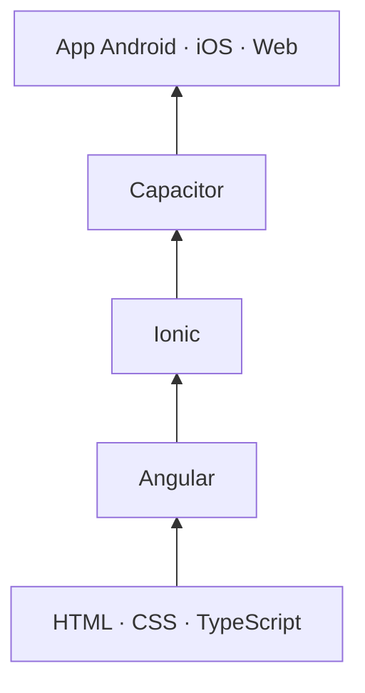

# Desarrollo de Aplicaciones Híbridas

**2º DAM · IES Rafael Alberti (Cádiz) · Curso 2026-2027**

Módulo de horas de libre configuración vinculado a *Programación Multimedia y Dispositivos Móviles (0489)*. En este módulo aprendes a crear **una sola aplicación que funciona en Android, iOS y web** con tecnologías web y acceso al hardware del móvil.

## Qué vas a construir

Al terminar el curso sabrás crear una app que:

- tiene varias pantallas con navegación, listas, formularios y el aspecto de una app de móvil;
- usa la **cámara, el GPS y los sensores** del teléfono;
- guarda datos **en el propio móvil** y **en la nube** (Firebase);
- consume **APIs externas** (incluida la que desarrollas en PMDM);
- está **probada automáticamente** y se instala en un móvil real como APK/AAB firmado.

## Las cuatro capas

| Capa | Qué hace | Analogía |
|---|---|---|
| **HTML, CSS y TypeScript** | La base web: estructura, estilo y lógica | Los materiales |
| **Angular** | Organiza la app en componentes, servicios y rutas | El esqueleto |
| **Ionic** | Da a la interfaz aspecto y comportamiento de app móvil | La ropa |
| **Capacitor** | Empaqueta la web como app nativa y da acceso al hardware | Las manos |

## Unidades

| UD | Título | RA | Semanas |
|---|---|---|---|
| [UD1](ud1/index.md) | Arquitectura y fundamentos de las aplicaciones híbridas | RA1 | 28 sep – 5 oct |
| [UD2](ud2/index.md) | Tecnologías y entornos: Angular + Ionic | RA2 | 19 – 26 oct |
| [UD3](ud3/index.md) | Componentes y funcionalidades específicas del móvil | RA2 | 9 – 23 nov |
| [UD4](ud4/index.md) | Consumo de servicios, APIs externas y persistencia | RA2 | 30 nov – 21 dic |
| [UD5](ud5/index.md) | Optimización, pruebas y despliegue | RA3 | 11 ene – 15 feb |

Consulta el [calendario completo](curso/calendario.md) y el [sistema de evaluación](curso/evaluacion.md).

!!! tip "Antes del primer lunes"
    Sigue la [Práctica guiada 0](ud1/practica-0.md): te lleva paso a paso desde la instalación hasta tu primera app en el móvil. Instalar Node, Android Studio y el móvil en modo depuración lleva tiempo; no lo dejes para clase.

## Stack del curso

TypeScript · Angular 22 (standalone, signals, control flow `@if/@for`) · Ionic 9 · Capacitor 8 · Firebase / AngularFire · Vitest · Cypress · Android Studio · Git y GitHub
