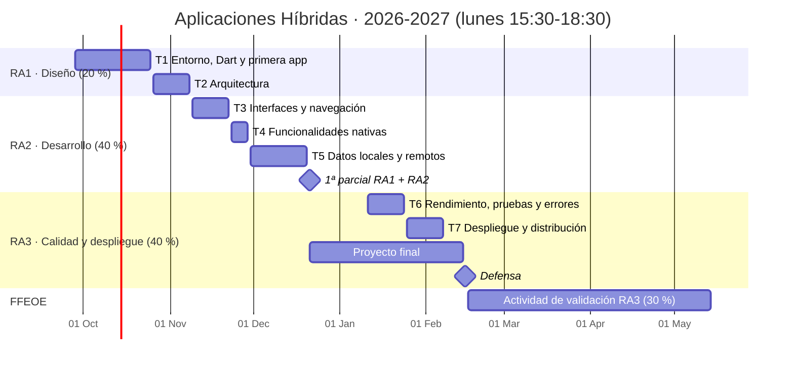
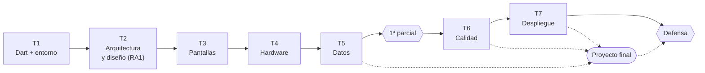
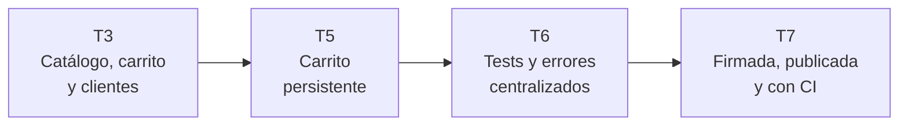

# Hoja de ruta del módulo

Visión global de todo el curso en una página: qué se da, cuándo, con qué actividades, cómo se evalúa y qué hay que tener preparado en cada momento.

## El módulo de un vistazo

**La idea que lo vertebra:** cada tema añade una capa a lo que el alumnado ya sabe hacer. Primero el lenguaje y el entorno, luego por qué Flutter (arquitectura), después pantallas, hardware y datos, y al final calidad y publicación. El **proyecto final** arranca en diciembre y junta todas las capas.

## Los siete temas

| Tema | Sesiones | RA · CE | Contenido esencial | Prácticas |
|---|---|---|---|---|
| [**T1 · Entorno, Dart y primera app**](../tema1/index.md) | 1-3 · 28 sep, 5 oct, 19 oct | RA2 a, c (base) | Instalación y `flutter doctor`. Dart desde cero (con puentes Java/Kotlin) hasta `Future`/`Stream`. La misma app en Android, web y escritorio | «Hola, plataformas» |
| [**T2 · Arquitectura y diseño**](../tema2/index.md) | 4 · 26 oct | RA1 a-e | Nativo, WebView, compilado, interpretado, KMP. Flutter por dentro. Elegir con criterio. Patrones, estructura y mobile-first | Informe de arquitectura y diseño (parejas) |
| [**T3 · Interfaces y navegación**](../tema3/index.md) | 5-6 · 9 y 16 nov | RA2 a, c, e · RA1 e | Widgets y layout (desde Compose), listas, estado con `setState` y `provider`, navegación, formularios, tema y diseño adaptable | 3.1 Cádiz Market · 3.2 Alta de clientes |
| [**T4 · Funcionalidades nativas**](../tema4/index.md) | 7 · 23 nov | RA2 b, c | Plugins, permisos, GPS, cámara, sensores, linterna, audio, ciclo de vida | 4.1 GPS con IA · 4.2 **Eureka** |
| [**T5 · Datos locales y remotos**](../tema5/index.md) | 8-9 · 30 nov, 14 dic | RA2 d | `http` + JSON, `FutureBuilder`, errores de red, CRUD contra la API de PMDM. `shared_preferences`, SQLite. Firebase Auth y Firestore | 5.1 Terremotos y mi API · 5.2 Mis lugares |
| **1ª parcial** | 10 · 21 dic | RA1 + RA2 | Prueba teórico-práctica. **Arranque del [proyecto final](../proyecto/index.md)** | Panel SCRUM |
| [**T6 · Rendimiento, pruebas y errores**](../tema6/index.md) | 11-12 · 11 y 18 ene | RA3 a, b, c | DevTools, las 10 reglas de rendimiento, tests unitarios, de widget y de integración, *mocks*, errores centralizados | 6.1 De malas a buenas prácticas · 6.2 Tests para Cádiz Market |
| [**T7 · Despliegue y distribución**](../tema7/index.md) | 13-14 · 25 ene, 1 feb | RA3 d, e | Identidad, firma, `flutter build` para cada plataforma, web en GitHub Pages / Firebase Hosting, tiendas, CI, documentación | 7.1 Cádiz Market en producción |
| **Cierre** | 15 · 15 feb | RA3 | Defensa del proyecto final · 2ª parcial · Presentación de la actividad FFEOE | Defensa |

## Cuánta práctica hay

Cada tema tiene cuatro niveles de práctica, de más guiado a más autónomo:

| Nivel | Qué es | Dónde se hace | Se entrega |
|---|---|---|---|
| **Ejercicios rápidos (R)** | 5-15 min, justo después de explicar cada apartado | En clase | No: se corrigen en voz alta |
| **Guiados (G)** | 20-30 min, el profesor y la clase construyen algo entre todos | En clase | No |
| **Boletín (B)** | 20-30 min cada uno, individuales | Clase y casa | Sí, uno por tema |
| **Prácticas** | Varias horas, una app completa con rúbrica | Casa | Sí |

| Tema | Rápidos | Guiados | Boletín | Prácticas |
|---|---|---|---|---|
| T1 | 22 | — | 6 | 1 |
| T2 | 4 | — | 5 casos | 1 |
| T3 | 16 | 4 | 10 | 2 |
| T4 | 9 | 1 | 9 | 2 |
| T5 | 12 | 4 | 10 | 2 |
| T6 | 10 | 2 | 8 | 2 |
| T7 | 9 | 2 | 8 | 1 |
| **Total** | **81** | **13** | **56** | **11 + proyecto** |

### Cádiz Market, el hilo conductor

Una misma app crece a lo largo del curso. Así el alumnado ve cómo evoluciona un proyecto real:

### Qué se reaprovecha del curso pasado

| Actividad del curso pasado (Ionic) | Versión Flutter | Tema |
|---|---|---|
| A2.4 Cádiz Market | Práctica 3.1: catálogo con filtros, stock y carrito con `provider` | T3 |
| A3.2 Calculadora y clientes | Práctica 3.2: alta y edición de clientes con validación | T3 |
| A3.3 GPS con IA | Práctica 4.1: servicio de ubicación escrito con IA y revisado | T4 |
| A3.4 **Eureka** | Práctica 4.2: GPS, sensores y cámara; linterna, texto y canción al tapar el sensor de luz | T4 |
| A4.1 Terremotos + API de PMDM | Práctica 5.1: USGS y CRUD contra la API Spring Boot de PMDM | T5 |
| A4.2 Mis lugares | Práctica 5.2: Firebase + GPS + foto + persistencia local | T5 |
| A4.3 Panel SCRUM | Arranque del proyecto final en GitHub Projects | 1ª parcial |
| A5.1 De malas a buenas prácticas | Práctica 6.1: app lenta a propósito para perfilarla y arreglarla | T6 |
| A5.2 Proyecto final | [Proyecto final](../proyecto/index.md) con requisitos Flutter | T6-T7 |

## Calendario de entregas

| Se entrega antes de | Actividad |
|---|---|
| Dom 18 oct | Boletín T1 |
| Dom 25 oct | Práctica «Hola, plataformas» |
| Dom 8 nov | Informe de arquitectura (T2) |
| Dom 22 nov | Boletín T3 · Práctica 3.1 Cádiz Market |
| Dom 29 nov | Práctica 3.2 Alta de clientes |
| Dom 6 dic | Boletín T4 · Práctica 4.1 GPS con IA |
| Dom 13 dic | Práctica 4.2 Eureka · Práctica 5.1 Terremotos y mi API |
| Dom 20 dic | Boletín T5 · Práctica 5.2 Mis lugares |
| Lun 21 dic | 1ª parcial · Arranque del proyecto |
| Dom 17 ene | Práctica 6.1 De malas a buenas prácticas |
| Dom 24 ene | Boletín T6 · Práctica 6.2 Tests para Cádiz Market |
| Dom 7 feb | Boletín T7 · Práctica 7.1 Cádiz Market en producción |
| Dom 14 feb | Proyecto final (defensa el lunes 15) |
| Jue 14 may | Actividad de validación de la FFEOE |

!!! warning "Diciembre va cargado"
    Entre el 6 y el 20 de diciembre se juntan cinco entregas antes de la parcial. Si ves al grupo ahogado, las dos primeras palancas son: hacer los boletines T4 y T5 **en clase** (los rápidos y guiados ya cubren parte) o pasar la Práctica 5.2 al 10 de enero.

## Evaluación

Los 15 criterios de evaluación oficiales, con su peso y sus instrumentos, están en [Resultados de aprendizaje](ra.md#ponderacion-e-instrumentos). Resumen:

| RA | Peso | Cada CE | Instrumentos principales |
|---|---|---|---|
| **RA1** | 20 % | 4 % | Informe de arquitectura y diseño (T2) · 1ª parcial · diseño inicial del proyecto · Práctica 3.1 (responsive) |
| **RA2** | 40 % | 8 % | Boletines y prácticas de T1, T3, T4 y T5 · 1ª parcial |
| **RA3** | 40 % | 8 % | **En el aula, 70 %:** prácticas 6.1, 6.2 y 7.1 y proyecto final con defensa. **En la FFEOE, 30 %:** actividad de validación |

!!! warning "Comprobar con el departamento"
    En la programación, los criterios del RA3 figuran con la actividad de la FFEOE como instrumento. Aquí se propone evaluarlos en el aula y validarlos en la FFEOE (70/30).

La actividad de la FFEOE está descrita en la página del [proyecto final](../proyecto/index.md#actividad-ffeoe).

## Qué te queda por preparar

Todos los temas están escritos. Lo que queda es **probarlos en tu equipo** una semana antes de darlos y preparar lo que no es código:

| Para antes de… | Tienes que tener listo |
|---|---|
| **Lun 28 sep** | Aula comprobada. Demo preparada. Guion de la sesión 1 |
| Lun 12 oct | Soluciones del boletín T1 |
| **Lun 2 nov** | Probar los ejemplos del T3 en tu Flutter. Tener tu propio Cádiz Market hecho (lo vas a enseñar) |
| **Lun 16 nov** | Probar Eureka en un móvil Android real (el emulador no tiene sensor de luz). Móviles de préstamo |
| **Lun 23 nov** | Proyecto Firebase de demostración creado. Comprobar si las cuentas del centro permiten Firebase |
| Lun 14 dic | 1ª parcial redactada. JSON del ejercicio B2 del T5 |
| **Lun 4 ene** | Probar la app lenta de la Práctica 6.1 en modo profile |
| **Lun 18 ene** | Tu propia clave de firma y un workflow de CI funcionando para enseñarlo |
| Lun 1 feb | Rúbrica de defensa impresa y enunciado de la FFEOE comunicado |

## Decisiones tomadas

| Decisión | Qué se usa | Por qué |
|---|---|---|
| Gestión de estado | `setState` y después `ChangeNotifier` + `provider` | Es la opción oficial más sencilla. Riverpod o Bloc añaden mucha complejidad para 7 semanas de RA2 |
| Navegación | `Navigator` y `NavigationBar`; `go_router` solo como ampliación | `Navigator.push` se entiende en 10 minutos |
| Base de datos remota | Firebase (Auth + Firestore) y la API de PMDM | Soporte oficial en Flutter, capa gratuita suficiente y continuidad con PMDM |
| Dispositivos | Emulador + **Chrome como plan B** + móviles Android reales en T4 | Los emuladores pesan mucho; Chrome arranca siempre. Los sensores necesitan móvil real |
| iOS | Solo demostración del profesor | Sin Macs en el aula no se puede compilar para iOS |
| Uso de IA | Permitida y **declarada**; obligatoria en la Práctica 4.1 | En la parcial y en la defensa no hay IA: tienen que saber explicar su código |

## Riesgos y cómo evitarlos

| Riesgo | Prevención |
|---|---|
| El primer día se va en instalaciones | Comprobar el aula antes. DartPad y Chrome como plan B |
| Emuladores lentos o que no arrancan | Ejecutar en Chrome o escritorio todo lo que no sea hardware |
| Versiones de paquetes que cambian a mitad de curso | Fijar la versión de Flutter del curso (la del 28 sep) y no actualizar hasta febrero |
| T4 sin móviles con sensores | Pedir que traigan su Android o reservar móviles del departamento |
| El proyecto final se come enero | Hitos quincenales revisados en clase y requisitos claros desde el 21 de diciembre |
| RA2 muy cargado | T3 y T5 tienen dos sesiones. Si hay retraso, diseño adaptable y SQLite pasan a opcionales |
