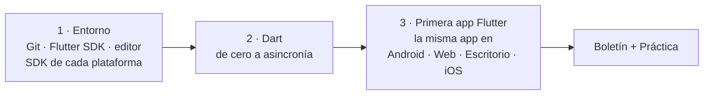

# Tema 1 · Entorno de desarrollo, Dart y primera app multiplataforma

!!! abstract "Ficha del tema"
    - **Duración:** 3 sesiones (≈ 9 horas)
    - **RA:** RA2 · CE a (primera interfaz) y c (asincronía y estados). Es la **base** de todo el RA2: el lenguaje y el entorno con los que se desarrollan el resto de criterios
    - **Actividades:** 22 ejercicios rápidos de clase ([sesión 1](#ejercicios-rapidos-sesion-1), [sesión 2](#ejercicios-rapidos-sesion-2), [sesión 3](#ejercicios-rapidos-sesion-3)) · [Boletín de 6 ejercicios](#4-boletin-de-ejercicios) · [Práctica «Hola, plataformas»](#5-practica-hola-plataformas)
    - **Al terminar tendrás:** el entorno instalado, soltura con Dart y **la misma app funcionando en Android, en el navegador y en tu escritorio**



## Objetivos

- [x] Instalar y verificar el entorno de Flutter en tu sistema operativo con `flutter doctor`.
- [x] Saber qué hace falta instalar para cada plataforma de destino y qué avisos se pueden ignorar.
- [x] Escribir programas en Dart: tipos, null safety, funciones, colecciones, clases, excepciones y asincronía.
- [x] Crear una app Flutter y ejecutarla en **al menos tres plataformas distintas** desde el mismo código.

!!! info "Ya lo conoces (DI y PMDM)"
    Ya tenéis **Android Studio** instalado desde DI y sabéis crear y arrancar un **emulador (AVD)** desde PMDM. Aquí no se repite: Flutter se instala **encima** de lo que ya tenéis.

---

## 1. El entorno de desarrollo

### 1.1 Qué hace falta y para qué

Flutter funciona con una idea sencilla: **un único SDK** (Flutter, que ya trae Dart dentro) y, **por cada plataforma a la que quieras compilar**, las herramientas nativas de esa plataforma. Flutter no sustituye a esas herramientas: **las usa por debajo** para generar el APK, la app de iOS o el ejecutable de escritorio.

| Pieza | ¿Para qué? | ¿Obligatoria? |
|---|---|---|
| **Git** | Descargar Flutter y gestionar versiones | Sí |
| **Flutter SDK** | El framework, el motor y los comandos `flutter` y `dart` | Sí |
| **Editor** con los plugins Flutter y Dart | Escribir código, hot reload y depurar | Sí |
| **Android Studio** (Android SDK, cmdline-tools, emulador) | Compilar y probar en **Android** | Sí en este módulo |
| **Chrome** o **Edge** | Ejecutar en **web** | Recomendado |
| **Visual Studio** (con *Desarrollo para el escritorio con C++*) | Escritorio **Windows** | Solo en Windows, opcional |
| **Xcode** + **CocoaPods** | **iOS** y escritorio **macOS** | Solo en Mac, opcional |
| `clang`, `cmake`, `ninja`, GTK… | Escritorio **Linux** | Solo en Linux, opcional |

!!! warning "Lo que no se puede hacer"
    **Solo se puede compilar para iOS y macOS desde un Mac.** Es una limitación de Apple, no de Flutter. Desde Windows o Linux podéis compilar para Android, web y el escritorio de vuestro propio sistema.

| Tu ordenador | Android | Web | Escritorio | iOS |
|---|---|---|---|---|
| Windows | ✅ | ✅ | ✅ Windows | ❌ |
| macOS | ✅ | ✅ | ✅ macOS | ✅ |
| Ubuntu | ✅ | ✅ | ✅ Linux | ❌ |

### 1.2 Qué editor usar

Hay dos opciones oficiales y las dos son igual de válidas:

| | **Android Studio** + plugin Flutter | **VS Code** + extensiones Flutter y Dart |
|---|---|---|
| Ventaja | **Ya lo tenéis instalado** (DI). Todo integrado: emuladores, SDK, inspector | Ligero y rápido. Muy usado en la comunidad Flutter |
| Inconveniente | Más pesado | Necesitas **igualmente** Android Studio para el Android SDK y los emuladores |
| En este módulo | **Opción por defecto** | Alternativa libre |

!!! note "Aunque uses VS Code, necesitas Android Studio"
    VS Code solo es el editor. El **Android SDK**, las **build-tools** y los **emuladores** se instalan y gestionan con Android Studio.

### 1.3 Instalar Git y el Flutter SDK

!!! warning "Antes de empezar"
    - Unos **5 GB** libres (SDK + herramientas de compilación).
    - Una ruta **sin espacios ni tildes**. Si tu usuario de Windows se llama `José Antonio`, **no** uses la carpeta de usuario: usa `C:\develop`.
    - **Cada bloque de código es un solo comando.** Cópialo, pégalo, pulsa Intro y espera a que termine antes del siguiente.

=== "Windows"

    **1. Instala Git.** Descárgalo desde [git-scm.com](https://git-scm.com/download/win) y deja las opciones por defecto. Abre **PowerShell** y comprueba:

    ```powershell
    git --version
    ```

    **2. Descarga Flutter.** Crea la carpeta de trabajo:

    ```powershell
    mkdir C:\develop
    ```

    ```powershell
    cd C:\develop
    ```

    ```powershell
    git clone https://github.com/flutter/flutter.git -b stable
    ```

    **3. Añádelo al PATH.**

    1. Pulsa ++win++ y busca **"variables de entorno"** → **Editar las variables de entorno de esta cuenta**.
    2. Selecciona **Path** → **Editar** → **Nuevo** → escribe `C:\develop\flutter\bin`.
    3. Con **Subir**, colócalo el primero de la lista. Acepta todo.
    4. **Cierra PowerShell y ábrelo de nuevo.**

=== "macOS"

    **1. Instala las herramientas de línea de comandos de Apple** (incluyen Git):

    ```bash
    xcode-select --install
    ```

    Si dice que ya están instaladas, perfecto. Comprueba Git:

    ```bash
    git --version
    ```

    **2. Descarga Flutter.** Crea la carpeta de trabajo:

    ```bash
    mkdir -p ~/develop
    ```

    ```bash
    cd ~/develop
    ```

    ```bash
    git clone https://github.com/flutter/flutter.git -b stable
    ```

    **3. Añádelo al PATH.** macOS usa `zsh`:

    ```bash
    echo 'export PATH="$HOME/develop/flutter/bin:$PATH"' >> ~/.zprofile
    ```

    ```bash
    source ~/.zprofile
    ```

    **4. Solo en Mac con chip Apple (M1, M2…):** instala Rosetta, que usan algunas herramientas:

    ```bash
    sudo softwareupdate --install-rosetta --agree-to-license
    ```

    !!! warning "Mac con procesador Intel"
        Flutter está retirando el soporte para Mac Intel: las próximas versiones exigirán Apple Silicon. De momento funciona, pero tenlo en cuenta si vas a comprar equipo.

=== "Ubuntu"

    **1. Instala Git y las utilidades básicas:**

    ```bash
    sudo apt-get update
    ```

    ```bash
    sudo apt-get install -y curl git unzip xz-utils zip libglu1-mesa
    ```

    **2. Descarga Flutter.** Crea la carpeta de trabajo:

    ```bash
    mkdir -p ~/develop
    ```

    ```bash
    cd ~/develop
    ```

    ```bash
    git clone https://github.com/flutter/flutter.git -b stable
    ```

    **3. Añádelo al PATH:**

    ```bash
    echo 'export PATH="$HOME/develop/flutter/bin:$PATH"' >> ~/.bashrc
    ```

    ```bash
    source ~/.bashrc
    ```

**4. Comprueba la instalación** (la primera vez tarda porque descarga el motor):

```bash
flutter --version
```

```bash
dart --version
```

Si los dos responden con un número de versión, el SDK está listo. **Dart viene dentro de Flutter**: no se instala por separado.

### 1.4 Android (todos)

Android Studio ya está instalado. Faltan tres cosas:

**1. Plugin de Flutter.** Android Studio → **Settings** (en Mac: *Android Studio → Settings*) → **Plugins** → **Marketplace** → busca **Flutter** → **Install**. Acepta cuando te pida instalar también **Dart**. Reinicia Android Studio.

**2. Android SDK Command-line Tools.** **Settings → Languages & Frameworks → Android SDK → pestaña SDK Tools** → marca **Android SDK Command-line Tools (latest)** → **Apply**.

**3. Licencias de Android.** Escribe `y` y pulsa Intro en cada pregunta:

```bash
flutter doctor --android-licenses
```

!!! info "Ya lo conoces (PMDM)"
    El emulador es el mismo AVD de PMDM. Arráncalo desde el **Device Manager**. Para usar un móvil real, activa la **depuración USB** como ya hicisteis.

### 1.5 Web (todos)

Basta con tener **Google Chrome** instalado. En Windows también sirve **Microsoft Edge**. No hay que configurar nada más.

### 1.6 Escritorio (opcional, según tu sistema)

=== "Windows"

    Instala **Visual Studio** (el IDE morado, **no** Visual Studio Code) desde [visualstudio.microsoft.com](https://visualstudio.microsoft.com/). En el instalador, marca la carga de trabajo **Desarrollo para el escritorio con C++**. Son varios GB: hazlo en casa.

=== "macOS"

    El escritorio macOS usa **Xcode**: sigue el apartado [1.7](#17-ios-solo-mac-opcional).

=== "Ubuntu"

    ```bash
    sudo apt-get install -y clang cmake ninja-build pkg-config libgtk-3-dev libstdc++-12-dev
    ```

### 1.7 iOS (solo Mac, opcional) { #17-ios-solo-mac-opcional }

**1. Instala Xcode** desde la Mac App Store. Pesa mucho: hazlo con buena conexión.

**2. Configura las herramientas de Xcode:**

```bash
sudo sh -c 'xcode-select -s /Applications/Xcode.app/Contents/Developer && xcodebuild -runFirstLaunch'
```

**3. Acepta la licencia:**

```bash
sudo xcodebuild -license
```

**4. Descarga la plataforma iOS del simulador:**

```bash
xcodebuild -downloadPlatform iOS
```

**5. Instala CocoaPods** (gestor de dependencias que usan muchos plugins de Flutter con código nativo de iOS/macOS). Con Homebrew:

```bash
brew install cocoapods
```

**6. Abre el simulador de iPhone.** Con Xcode 26 o anterior:

```bash
open -a Simulator
```

Con Xcode 27 el simulador se llama **Device Hub**:

```bash
open -a DeviceHub
```

!!! note "Móvil iPhone real"
    Para instalar en un iPhone físico hace falta además una **cuenta de Apple** configurada en Xcode (*Signing & Capabilities*). Para este tema basta con el simulador.

### 1.8 `flutter doctor`: el diagnóstico

```bash
flutter doctor
```

Revisa todo el entorno y, para cada problema, **dice cómo arreglarlo**. Una salida típica en Windows la primera vez:

```text
Doctor summary (to see all details, run flutter doctor -v):
[✓] Flutter (Channel stable, ...)
[✓] Windows Version
[!] Android toolchain - develop for Android devices
    ✗ cmdline-tools component is missing
    ✗ Android license status unknown.
[✓] Chrome - develop for the web
[✗] Visual Studio - develop Windows apps
[✓] Android Studio
[✓] Connected device (2 available)
[✓] Network resources
```

| Marca | Significado |
|---|---|
| `[✓]` | Correcto |
| `[!]` | Funciona a medias: hay algo que corregir |
| `[✗]` | No está instalado o no funciona |

**No hace falta tener todo en verde.** Solo lo que corresponde a las plataformas para las que vas a compilar:

| Línea del doctor | ¿Obligatoria en este módulo? |
|---|---|
| Flutter | **Sí** |
| Android toolchain | **Sí** |
| Android Studio | **Sí** (o VS Code si lo usas como editor) |
| Chrome | Muy recomendable (web) |
| Visual Studio / Xcode / Linux toolchain | Solo si quieres escritorio o iOS |
| Connected device | Aparece en verde cuando hay un emulador, un navegador o tu escritorio disponibles |

Para ver todos los detalles:

```bash
flutter doctor -v
```

### 1.9 Problemas frecuentes

??? failure "`flutter` no se reconoce como un comando"
    El PATH no está bien o no has reabierto la terminal. Comprueba que la ruta termina en `flutter\bin` (Windows) o `flutter/bin` (macOS/Linux).

??? failure "Unable to find Android Studio"
    Si lo instalaste en una ruta poco habitual, indícasela a Flutter (cambia la ruta por la tuya):

    ```bash
    flutter config --android-studio-dir="C:\ruta\a\Android Studio"
    ```

??? failure "Waiting for another flutter command to release the startup lock"
    Hay otro comando `flutter` en marcha, a menudo el propio Android Studio. Espera o ciérralo.

??? failure "El emulador no aparece en `flutter devices`"
    Comprueba que está **arrancado** y que `adb devices` lo ve (PMDM). Si `adb` no lo ve, el problema es del emulador, no de Flutter.

# ??? failure "En el aula: errores de red o de proxy"
#    Avisa al profesor: puede que haga falta configurar el proxy del centro o usar un SDK ya descargado en una unidad compartida.

---

## 2. Dart desde cero

Dart es el lenguaje de Flutter. Es de tipado estático, orientado a objetos y con **null safety**. Vais a ver que se parece mucho a lo que ya conocéis: **con clases y llaves como Java, y con null safety e inferencia como Kotlin**. En cada apartado hay una nota para que traduzcas desde tu lenguaje de 1º.

### 2.1 Cómo ejecutar Dart

Tienes dos formas:

| Dónde | Cómo | Cuándo |
|---|---|---|
| **En local** | Un fichero `.dart` y el comando `dart run` | Lo normal: ya tienes Dart instalado con Flutter |
| **[DartPad](https://dartpad.dev)** | En el navegador, sin instalar nada | Pruebas rápidas o si tu equipo aún no está listo |

**En local:** crea una carpeta `dart_tema1`, ábrela con tu editor y crea un fichero `hola.dart`:

```dart
void main() {
  print('¡Hola, Cádiz!');
}
```

Ejecútalo desde la terminal, dentro de esa carpeta:

```bash
dart run hola.dart
```

!!! tip "Pulsa Format a menudo"
    Dart tiene un **formato oficial único**. En Android Studio: *Code → Reformat Code*. En VS Code: *Format Document*. En DartPad: botón **Format**. Desde la terminal:

    ```bash
    dart format hola.dart
    ```

    Truco: deja una **coma final** tras el último argumento y el formateador pondrá cada argumento en su línea. En Flutter lo usaréis constantemente.

### 2.2 Variables y tipos

```dart
void main() {
  // Tipo explícito
  int edad = 19;
  double nota = 7.5;
  String nombre = 'Lola';
  bool matriculada = true;

  // Inferencia: el tipo lo deduce el compilador y ya no cambia
  var ciudad = 'Cádiz';       // String
  // ciudad = 3;              // ❌ Error: ciudad es String

  // Constantes
  final hoy = DateTime.now(); // se fija en ejecución, una sola vez
  const maxAlumnos = 30;      // se fija al compilar

  print('$nombre tiene $edad años, vive en $ciudad y tiene un $nota');
  print('Hoy es ${hoy.day}/${hoy.month}. Máximo: $maxAlumnos alumnos. ¿Matriculada? $matriculada');
}
```

| Tipo | Ejemplo | Nota |
|---|---|---|
| `int` | `42` | Entero de 64 bits. **Un único tipo entero** |
| `double` | `3.14` | Decimal. **Un único tipo decimal** |
| `num` | `42` o `3.14` | Supertipo de `int` y `double` |
| `String` | `'texto'` | Comillas simples por convención |
| `bool` | `true` | |
| `var` | `var x = 5;` | Infiere el tipo |
| `final` | `final x = 5;` | Solo se asigna una vez |
| `const` | `const x = 5;` | Valor conocido **al compilar** |
| `dynamic` | `dynamic x = 5;` | Desactiva la comprobación de tipos. **Evítalo** |

=== "Si vienes de Java"

    | Java | Dart |
    |---|---|
    | `int`, `long`, `short`, `byte` | `int` |
    | `double`, `float` | `double` |
    | `boolean` | `bool` |
    | `final int x = 5;` | `final x = 5;` |
    | `static final int MAX = 30;` | `const max = 30;` |

=== "Si vienes de Kotlin"

    | Kotlin | Dart |
    |---|---|
    | `val x: Int = 5` | `final int x = 5;` (el tipo va **delante**) |
    | `var x = 5` | `var x = 5;` |
    | `const val MAX = 30` | `const max = 30;` |
    | `Int`, `Double`, `Boolean` | `int`, `double`, `bool` (minúscula) |
    | Sin `;` | **Con `;` obligatorio** |

### 2.3 Null safety

En Dart, **un tipo normal nunca puede ser `null`**. Si una variable puede no tener valor, se indica con `?`. El compilador **no te deja** usarla sin comprobarlo.

```dart
void main() {
  String nombre = 'Ana';
  // nombre = null;            // ❌ Error de compilación

  String? apodo;               // Puede ser null (y empieza siéndolo)

  // print(apodo.length);      // ❌ Error: apodo podría ser null
  print(apodo?.length);        // null  → ?. solo accede si no es null
  print(apodo ?? 'sin apodo'); // sin apodo → ?? valor por defecto

  apodo ??= 'Anita';           // asigna solo si es null
  if (apodo != null) {
    print(apodo.length);       // dentro del if, Dart sabe que no es null
  }
}
```

| Operador | Significado |
|---|---|
| `T?` | Tipo que admite `null` |
| `a?.b` | Accede a `b` solo si `a` no es null; si no, da `null` |
| `a ?? b` | `a` si no es null; si no, `b` |
| `a ??= b` | Asigna `b` solo si `a` es null |
| `a!` | "Te aseguro que no es null". Si lo es, **excepción** |
| `late` | "Le daré valor antes de usarla" (inicialización tardía) |

!!! warning "El `!` es una trampa"
    Usar `!` para callar al compilador es traer de vuelta el `NullPointerException`. Úsalo solo cuando **sabes** algo que el compilador no puede saber.

Un caso real: leer del teclado. `stdin.readLineSync()` devuelve `String?` porque la entrada puede acabarse, e `int.tryParse` devuelve `int?` porque el texto puede no ser un número:

```dart
import 'dart:io';

void main() {
  stdout.write('¿Cuántos años tienes? ');
  final texto = stdin.readLineSync();          // String?
  final edad = int.tryParse(texto ?? '');      // int?

  if (edad == null) {
    print('Eso no es un número');
  } else {
    print('El año que viene tendrás ${edad + 1}');
  }
}
```

!!! note "El teclado no funciona en DartPad"
    `stdin` solo funciona en local (`dart run`). En DartPad, escribe los datos de prueba en el propio código.

=== "Si vienes de Java"
    Es lo más nuevo para ti. En Java cualquier referencia puede ser `null` y el error salta en ejecución; en Dart salta **al compilar**.

=== "Si vienes de Kotlin"
    **Idéntico** a Kotlin, salvo dos símbolos: el Elvis `?:` es `??` y `!!` es `!`. No hay `let` ni `it`: se usa `if (x != null)`.

### 2.4 Operadores

```dart
void main() {
  print(7 / 2);    // 3.5  → la división SIEMPRE da double
  print(7 ~/ 2);   // 3    → división entera
  print(7 % 2);    // 1    → resto
  print(2 == 2.0); // true

  var puntos = 10;
  puntos += 5;
  puntos++;
  print(puntos);   // 16

  final aprobado = puntos >= 15 && puntos < 20;
  print(aprobado ? 'Dentro del rango' : 'Fuera');

  Object dato = 'hola';
  if (dato is String) {
    print(dato.toUpperCase());  // tras el is, dato ya es String
  }
}
```

| | Java | Kotlin | Dart |
|---|---|---|---|
| División entera | `7 / 2` con `int` | `7 / 2` con `Int` | `7 ~/ 2` |
| Comprobar tipo | `instanceof` | `is` | `is` |
| Cast | `(String) o` | `o as String` | `o as String` |
| Comparar contenido | `a.equals(b)` | `a == b` | `a == b` |

### 2.5 Cadenas

```dart
void main() {
  final nombre = 'Carmen';
  final nota = 8.456;

  print('Hola, $nombre');                            // interpolación
  print('Nota: ${nota.toStringAsFixed(1)}');         // expresión → 8.5
  print('Tiene ${nombre.length} letras');

  final multilinea = '''
Oh, Cádiz,
tacita de plata''';
  print(multilinea);

  print(nombre.toUpperCase());       // CARMEN
  print(nombre.contains('men'));     // true
  print('a,b,c'.split(','));         // [a, b, c]
  print('  espacios  '.trim());      // espacios
  print(nombre.substring(0, 3));     // Car
}
```

### Ejercicios rápidos de clase (sesión 1) { #ejercicios-rapidos-sesion-1 }

Cortos (5-10 minutos cada uno) para ir cogiendo soltura. Cada uno en su fichero (`r1.dart`, `r3.dart`…) dentro de `dart_tema1`. No se entregan.

!!! example "R1 · Hola, Dart"
    Escribe un programa que muestre tu nombre, tu ciclo y tu ciudad en tres líneas. Después, guarda esos datos en variables y muéstralos en **una sola línea** con interpolación:
    `Soy Lucía, estudio 2º DAM en Cádiz.`

!!! example "R2 · Hola, mundo en varias plataformas"
    1. Crea un proyecto Flutter: `flutter create --org es.iesrafaelalberti hola_mundo`.
    2. En `lib/main.dart`, busca el texto `'Flutter Demo Home Page'` y cámbialo por `'Hola, <tu nombre>'`.
    3. Ejecútalo en **Chrome** (`flutter run -d chrome`) y en **al menos otra plataforma** (emulador Android o escritorio). Haz una captura de cada una.
    4. Con la app abierta, cambia el texto otra vez y pulsa ++r++. ¿Qué ha pasado con el contador?

!!! example "R3 · Ticket del bar"
    Con las variables `producto` (`String`), `precio` (`double`), `unidades` (`int`) y `terraza` (`bool`), calcula el total (la terraza suma un 10 %) y muestra:
    `3 x Café con leche a 1.40 € = 4.62 € (terraza)`
    Usa `toStringAsFixed(2)`. Prueba con `terraza = false` para que no aparezca el paréntesis.

!!! example "R4 · Conversor"
    1. Pasa 25 °C, 0 °C y 40 °C a Fahrenheit (`F = C × 9 / 5 + 32`).
    2. Declara `const tasaDolar = 1.08;` y convierte 50 € a dólares.
    3. ¿Por qué `tasaDolar` puede ser `const` y la hora actual (`DateTime.now()`) no?

!!! example "R5 · Segundos a horas"
    Dado `final segundos = 7384;`, muestra `2 h 3 min 4 s` usando `~/` y `%`.
    **Extra:** muéstralo como `02:03:04` con `toString().padLeft(2, '0')`.

!!! example "R6 · ¿Tienes apodo?"
    Declara `final nombre = 'Francisco';` y `String? apodo;`.
    1. Saluda con el apodo si lo tiene y, si no, con el nombre, en **una sola línea** con `??`.
    2. Muestra la longitud del apodo con `?.` sin que aparezca `null` (pista: `?? 0`).
    3. Dale valor al apodo (`'Curro'`) y vuelve a ejecutar. ¿Qué cambia?

!!! example "R7 · Iniciales"
    Con `nombre = 'maría'`, `apellido1 = 'ruiz'` y `apellido2 = 'pérez'`:
    1. Muestra las iniciales en mayúsculas: `M.R.P.` (pista: `nombre[0]`).
    2. Muestra el nombre completo con la primera letra de cada parte en mayúscula: `María Ruiz Pérez`.
    3. Muestra cuántas letras tiene en total, sin contar espacios.

!!! example "R8 · Reto: ¿mayor de edad? (solo en local)"
    Pide la edad por teclado con `stdin.readLineSync()` e `int.tryParse`.
    - Si no es un número: `"hola" no es una edad válida`.
    - Si es un número: indica si es mayor de edad y cuántos años faltan para los 18 (o cuántos han pasado).

### 2.6 Control de flujo

**`if` / `else`** funciona como siempre.

**`switch` como expresión** (devuelve un valor, como el `when` de Kotlin):

```dart
String calificacion(int nota) => switch (nota) {
      10 => 'Matrícula',
      >= 9 => 'Sobresaliente',
      >= 7 => 'Notable',
      6 => 'Bien',
      5 => 'Suficiente',
      _ => 'Insuficiente',   // _ = cualquier otro caso
    };

void main() {
  for (final n in [10, 8, 6, 5, 2]) {
    print('$n → ${calificacion(n)}');
  }
}
```

**Bucles:**

```dart
void main() {
  // for clásico
  for (var i = 1; i <= 3; i++) {
    print('Vuelta $i');
  }

  // for-in: recorrer una colección
  final playas = ['La Caleta', 'Santa María', 'La Victoria'];
  for (final playa in playas) {
    print('Playa: $playa');
  }

  // while
  var cuenta = 3;
  while (cuenta > 0) {
    print(cuenta--);
  }
  print('¡Al agua!');
}
```

| | Java | Kotlin | Dart |
|---|---|---|---|
| Recorrer | `for (String p : playas)` | `for (p in playas)` | `for (final p in playas)` |
| Rango | `for (int i=1;i<=3;i++)` | `for (i in 1..3)` | `for (var i = 1; i <= 3; i++)` |
| Selección múltiple | `switch` | `when` | `switch` (sentencia o expresión) |

### 2.7 Funciones

```dart
// Función normal con tipo de retorno
int sumar(int a, int b) {
  return a + b;
}

// Función flecha: para una sola expresión
int doble(int x) => x * 2;

// Parámetros CON NOMBRE (entre llaves). required = obligatorio
String ficha({required String nombre, int edad = 18, String? ciudad}) =>
    '$nombre, $edad años, ${ciudad ?? 'ciudad desconocida'}';

// Parámetros posicionales opcionales (entre corchetes)
String saludar(String nombre, [String saludo = 'Hola']) => '$saludo, $nombre';

void main() {
  print(sumar(2, 3));
  print(doble(21));
  print(ficha(nombre: 'Rocío'));
  print(ficha(ciudad: 'Jerez', nombre: 'Pablo', edad: 20)); // el orden da igual
  print(saludar('Ana'));
  print(saludar('Ana', 'Buenas'));

  // Las funciones son valores: se guardan y se pasan como parámetro
  final triple = (int x) => x * 3;
  print(triple(5));
  print(aplicar(4, doble));
}

int aplicar(int valor, int Function(int) operacion) => operacion(valor);
```

!!! tip "Los parámetros con nombre son la clave de Flutter"
    **Todos** los widgets se construyen así: `Text('Hola', style: ..., textAlign: ...)`. Si entiendes `ficha(nombre: ..., edad: ...)`, entiendes cómo se escribe una pantalla.

| Sintaxis | Tipo | Llamada |
|---|---|---|
| `f(int x)` | Posicional obligatorio | `f(3)` |
| `f([int x = 0])` | Posicional opcional | `f()` / `f(3)` |
| `f({int x = 0})` | Con nombre, opcional | `f()` / `f(x: 3)` |
| `f({required int x})` | Con nombre, obligatorio | `f(x: 3)` |

| | Java | Kotlin | Dart |
|---|---|---|---|
| Lambda | `x -> x * 2` | `{ x -> x * 2 }` | `(x) => x * 2` |
| Una línea | — | `fun doble(x: Int) = x * 2` | `int doble(int x) => x * 2;` |
| Por defecto | Sobrecarga | `fun f(x: Int = 0)` | `f({int x = 0})` |
| Sobrecarga | Sí | Sí | **No existe** |

### 2.8 Colecciones

```dart
void main() {
  // List (mutable por defecto)
  final notas = [4, 7, 9, 3, 6];
  notas.add(8);
  print(notas.length);             // 6
  print(notas.first);              // 4

  // Métodos funcionales
  final aprobadas = notas.where((n) => n >= 5).toList();
  final dobles = notas.map((n) => n * 2).toList();
  final suma = notas.fold(0, (total, n) => total + n);
  print(aprobadas);                // [7, 9, 6, 8]
  print(dobles);                   // [8, 14, 18, 6, 12, 16]
  print(suma / notas.length);      // 6.166...
  print(notas.any((n) => n == 10)); // false

  // Set: sin repetidos
  final modalidades = {'comparsa', 'chirigota', 'coro', 'comparsa'};
  print(modalidades);              // {comparsa, chirigota, coro}

  // Map: clave → valor
  final habitantes = {'Cádiz': 110000, 'Jerez': 212000};
  habitantes['Rota'] = 29000;
  print(habitantes['Jerez']);      // 212000
  print(habitantes['Sevilla']);    // null → por eso devuelve int?
  habitantes.forEach((ciudad, n) => print('$ciudad: $n'));

  // if, for y spread dentro de un literal (muy usado en Flutter)
  final esAdmin = true;
  final menu = [
    'Inicio',
    if (esAdmin) 'Administración',
    for (final c in habitantes.keys) 'Ver $c',
    ...['Ayuda', 'Salir'],
  ];
  print(menu);
}
```

!!! warning "`map` y `where` devuelven un `Iterable`"
    Si necesitas una lista (casi siempre), termina con `.toList()`.

| Java | Kotlin | Dart |
|---|---|---|
| `new ArrayList<>()` | `mutableListOf()` | `[]` |
| `Map.of("a", 1)` | `mapOf("a" to 1)` | `{'a': 1}` |
| `stream().filter()` | `filter { }` | `where(...)` |
| `stream().map()` | `map { }` | `map(...)` |
| `reduce` | `fold` / `reduce` | `fold` / `reduce` |

### 2.9 Clases y objetos

```dart
class Alumno {
  final String nombre;           // no cambia
  int nota;                      // sí cambia
  String? email;                 // opcional

  // Constructor: asigna los campos directamente
  Alumno(this.nombre, this.nota, {this.email});

  // Constructor con nombre (Dart no tiene sobrecarga)
  Alumno.nuevo(this.nombre) : nota = 0;

  // Getter: se usa como si fuera un campo
  bool get aprobado => nota >= 5;

  void subirNota(int puntos) {
    nota = (nota + puntos).clamp(0, 10).toInt();
  }

  @override
  String toString() => '$nombre ($nota)${email != null ? ' <$email>' : ''}';
}

void main() {
  final a = Alumno('Lola', 7, email: 'lola@alberti.es');
  final b = Alumno.nuevo('Juan');
  b.subirNota(6);

  print(a);            // Lola (7) <lola@alberti.es>
  print(b);            // Juan (6)
  print(b.aprobado);   // true
}
```

- **No hay `new`**: se escribe `Alumno(...)`.
- **No hay `public`/`private`**: un nombre que empieza por `_` es **privado** al fichero (`_saldo`).
- **`@override`** para sobrescribir, igual que en Java.

**Herencia, clases abstractas e interfaces:**

```dart
abstract class Agrupacion {
  final String nombre;
  Agrupacion(this.nombre);

  int get componentesMaximos;           // abstracto: las hijas lo definen
  String presentarse() => 'Somos $nombre';
}

class Chirigota extends Agrupacion {
  Chirigota(super.nombre);              // pasa el nombre al padre

  @override
  int get componentesMaximos => 12;

  @override
  String presentarse() => '${super.presentarse()} y venimos a reírnos';
}

class Coro extends Agrupacion {
  Coro(super.nombre);

  @override
  int get componentesMaximos => 45;
}

void main() {
  final List<Agrupacion> concurso = [Chirigota('Los Yesterday'), Coro('La Viña')];
  for (final a in concurso) {
    print('${a.presentarse()} (máx. ${a.componentesMaximos})');
  }
}
```

**Enums** (pueden tener campos, como en Java):

```dart
enum Modalidad {
  comparsa('Comparsa', 15),
  chirigota('Chirigota', 12),
  coro('Coro', 45),
  cuarteto('Cuarteto', 5);

  final String etiqueta;
  final int maxComponentes;
  const Modalidad(this.etiqueta, this.maxComponentes);
}

void main() {
  for (final m in Modalidad.values) {
    print('${m.etiqueta}: hasta ${m.maxComponentes}');
  }
}
```

| | Java | Kotlin | Dart |
|---|---|---|---|
| Constructor | `this.x = x;` en el cuerpo | `class A(val x: Int)` | `A(this.x);` |
| Heredar | `extends` | `: Padre()` | `extends` |
| Interfaz | `interface` + `implements` | `interface` + `:` | `abstract class` + `implements` |
| Privado | `private` | `private` | `_nombre` |
| Datos | *record* / POJO | `data class` | clase con `toString` o un *record* |
| Estático | `static` | `companion object` | `static` |

### 2.10 Excepciones

```dart
class SaldoInsuficiente implements Exception {
  final double falta;
  SaldoInsuficiente(this.falta);

  @override
  String toString() => 'Saldo insuficiente: faltan ${falta.toStringAsFixed(2)} €';
}

double pagar(double saldo, double importe) {
  if (importe > saldo) throw SaldoInsuficiente(importe - saldo);
  return saldo - importe;
}

void main() {
  try {
    print(pagar(20, 12.5));
    print(pagar(5, 12.5));
  } on SaldoInsuficiente catch (e) {
    print('Error controlado: $e');
  } catch (e) {
    print('Error inesperado: $e');
  } finally {
    print('Fin de la operación');
  }
}
```

!!! info "Sin excepciones comprobadas"
    En Dart **ninguna** excepción obliga a capturarla ni a declararla con `throws` (como en Kotlin).

### Ejercicios rápidos de clase (sesión 2) { #ejercicios-rapidos-sesion-2 }

Tras los apartados 2.6 a 2.10. Cada uno en su fichero dentro de `dart_tema1`. .

| # | Ejercicio | Apartado |
|---|---|---|
| R9 | **Par, impar y signo.** Recorre del -3 al 10 e imprime `-3 es impar y negativo`, `0 es par y cero`… El signo, con un `switch` como expresión | 2.6 |
| R10 | **FizzBuzz gaditano.** Del 1 al 30: múltiplos de 3 → `Chirigota`, de 5 → `Comparsa`, de ambos → `¡Carnaval!`, el resto, el número | 2.6 |
| R11 | **Tabla de multiplicar.** `String tabla(int n, {int hasta = 10})` que devuelva la tabla en un texto de varias líneas. Llámala con y sin `hasta` | 2.7 |
| R12 | **¿Bisiesto?** `bool esBisiesto(int anio) => ...;` en una sola línea. Pruébalo con 2024, 2023, 1900 y 2000 | 2.7 |
| R13 | **Estadísticas de notas.** Con `[6.5, 4.2, 9.1, 7.0, 3.8, 5.0]`: media con `fold`, máxima con `reduce`, cuántas aprobadas con `where` y la lista ordenada de mayor a menor | 2.8 |
| R14 | **Contador de palabras.** Dado un texto, construye un `Map<String, int>` con cuántas veces aparece cada palabra (en minúsculas, sin comas ni puntos) | 2.5, 2.8 |
| R15 | **Cuenta bancaria.** Clase `CuentaBancaria` con titular, `_saldo` privado, getter `saldo`, `ingresar` y `retirar`. Retirar más de lo que hay lanza una excepción propia que capturas en `main` | 2.9, 2.10 |
| R16 | **Figuras.** Clase abstracta `Figura` con getter `area`; subclases `Circulo` y `Rectangulo`. Una `List<Figura>` y el área total | 2.9 |

### 2.11 Asincronía: `Future`, `async` y `await`

!!! danger "El apartado más importante del tema"
    Una app tiene **un solo hilo** que pinta la pantalla. Si ese hilo se queda esperando 3 segundos a un servidor, la app **se congela**. En Flutter casi todo lo interesante **tarda**: descargar datos, leer la base de datos, obtener el GPS, abrir la cámara. Por eso el 80 % del código real es **esperar datos sin bloquear**.

Un **`Future<T>`** es la promesa de un valor de tipo `T` que llegará **más adelante**, o de un error.

> Es como el ticket de la freiduría: pides, te dan un número (**el `Future`**) y vas a por la bebida. Cuando cantan tu número recoges el pescado (**el valor**), o te dicen que se ha acabado el cazón (**el error**).

```dart
Future<String> pedirPescado() async {
  await Future.delayed(const Duration(seconds: 2)); // simula una espera
  return 'Cazón en adobo';
}

Future<void> main() async {
  print('1. Pido en la freiduría');
  final pescado = await pedirPescado();   // espera SIN bloquear el hilo
  print('2. Ya tengo: $pescado');
}
```

- `async` marca una función asíncrona. **Siempre devuelve un `Future`.**
- `await` espera a que el `Future` termine y te da su valor. Solo se puede usar dentro de una función `async`.

**¿Qué pasa si no pones `await`?**

```dart
Future<void> tarea(String nombre, int segundos) async {
  print('  → empiezo $nombre');
  await Future.delayed(Duration(seconds: segundos));
  print('  ✓ termino $nombre');
}

Future<void> main() async {
  print('Inicio');
  tarea('A', 2);                 // sin await: la lanzo y sigo
  tarea('B', 1);                 // sin await
  print('He lanzado A y B');
  await Future.delayed(const Duration(seconds: 3));
  print('Fin');
}
```

```text
Inicio
  → empiezo A
  → empiezo B
He lanzado A y B
  ✓ termino B
  ✓ termino A
Fin
```

B termina antes que A: mientras A esperaba, el hilo estaba libre para B. **Eso es la asincronía.**

**Errores con `try` / `catch`:**

```dart
import 'dart:math';

Future<String> descargarDatos() async {
  await Future.delayed(const Duration(seconds: 1));
  if (Random().nextBool()) throw Exception('Sin conexión');
  return '{"agrupaciones": 32}';
}

Future<void> main() async {
  try {
    final datos = await descargarDatos();
    print('Recibido: $datos');
  } catch (e) {
    print('Ha fallado: $e');
  }
}
```

**Varias peticiones a la vez con `Future.wait`:**

```dart
Future<String> pedir(String plato, int segundos) =>
    Future.delayed(Duration(seconds: segundos), () => plato);

Future<void> main() async {
  final reloj = Stopwatch()..start();
  final platos = await Future.wait([
    pedir('Cazón', 2),
    pedir('Choco', 3),
    pedir('Puntillitas', 1),
  ]);
  print('$platos en ${reloj.elapsed.inSeconds} s');   // 3 s, no 6
}
```

**Streams, por encima.** Un `Future` da **un** valor; un `Stream` da **muchos a lo largo del tiempo**: la posición GPS mientras caminas, los mensajes de un chat…

```dart
Stream<int> cuentaAtras(int desde) async* {
  for (var i = desde; i > 0; i--) {
    await Future.delayed(const Duration(seconds: 1));
    yield i;                          // emite un valor y sigue
  }
}

Future<void> main() async {
  await for (final n in cuentaAtras(3)) {
    print(n);
  }
  print('¡Que empiece el Carnaval!');
}
```

| | Java | Kotlin | Dart |
|---|---|---|---|
| Valor futuro | `CompletableFuture<T>` | `Deferred<T>` / `suspend` | `Future<T>` |
| Esperar | `.get()` (**bloquea**) | dentro de una corrutina | `await` (no bloquea) |
| Varios valores en el tiempo | — | `Flow<T>` | `Stream<T>` |

---

## 3. Primera app Flutter en varias plataformas

Ya tienes el entorno y sabes Dart. Ahora creamos **una app** y la ejecutamos en **varias plataformas sin tocar el código**.

### 3.1 Crear el proyecto

En la terminal, dentro de tu carpeta de proyectos:

```bash
flutter create --org es.iesrafaelalberti hola_plataformas
```

- `hola_plataformas`: nombre del proyecto en **minúsculas y guiones bajos**.
- `--org`: identificador del paquete. La app será `es.iesrafaelalberti.hola_plataformas`.

Entra en la carpeta:

```bash
cd hola_plataformas
```

!!! tip "También desde Android Studio"
    **New Flutter Project** → indica la ruta del SDK (`C:\develop\flutter` o `~/develop/flutter`) → nombre y organización. Hace lo mismo que `flutter create`.

### 3.2 Estructura

```text
hola_plataformas/
├── lib/
│   └── main.dart          ← TU CÓDIGO (aquí trabajas casi siempre)
├── test/                  ← pruebas
├── android/  ios/  web/  windows/  macos/  linux/
│                          ← un proyecto "envoltorio" por plataforma
├── pubspec.yaml           ← nombre, versión y dependencias
└── analysis_options.yaml  ← reglas del analizador
```

**El código está una sola vez en `lib/`.** Las carpetas de cada plataforma son proyectos nativos (Gradle en `android/`, Xcode en `ios/`…) que Flutter genera y que casi nunca se tocan.

!!! info "Ya lo conoces (DI)"
    `android/` es un proyecto Gradle como los de DI. `pubspec.yaml` hace el papel de las dependencias de `build.gradle.kts`.

### 3.3 El código

Sustituye **todo** el contenido de `lib/main.dart` por esto:

```dart
import 'package:flutter/foundation.dart';
import 'package:flutter/material.dart';

void main() => runApp(const HolaPlataformasApp());

/// Devuelve el nombre de la plataforma en la que se está ejecutando la app.
String nombrePlataforma() {
  if (kIsWeb) return 'Web';
  return switch (defaultTargetPlatform) {
    TargetPlatform.android => 'Android',
    TargetPlatform.iOS => 'iOS',
    TargetPlatform.macOS => 'macOS',
    TargetPlatform.windows => 'Windows',
    TargetPlatform.linux => 'Linux',
    TargetPlatform.fuchsia => 'Fuchsia',
  };
}

/// Icono según la plataforma.
IconData iconoPlataforma() {
  if (kIsWeb) return Icons.language;
  return switch (defaultTargetPlatform) {
    TargetPlatform.android => Icons.android,
    TargetPlatform.iOS => Icons.phone_iphone,
    TargetPlatform.macOS => Icons.laptop_mac,
    TargetPlatform.windows => Icons.desktop_windows,
    _ => Icons.computer,
  };
}

class HolaPlataformasApp extends StatelessWidget {
  const HolaPlataformasApp({super.key});

  @override
  Widget build(BuildContext context) {
    return MaterialApp(
      title: 'Hola, plataformas',
      debugShowCheckedModeBanner: false,
      theme: ThemeData(colorScheme: ColorScheme.fromSeed(seedColor: Colors.indigo)),
      home: const PantallaInicio(),
    );
  }
}

class PantallaInicio extends StatefulWidget {
  const PantallaInicio({super.key});

  @override
  State<PantallaInicio> createState() => _PantallaInicioState();
}

class _PantallaInicioState extends State<PantallaInicio> {
  int _pulsaciones = 0;

  @override
  Widget build(BuildContext context) {
    final plataforma = nombrePlataforma();

    return Scaffold(
      appBar: AppBar(title: const Text('Hola, plataformas')),
      body: Center(
        child: Column(
          mainAxisAlignment: MainAxisAlignment.center,
          children: [
            Icon(iconoPlataforma(), size: 96),
            const SizedBox(height: 16),
            Text(
              '¡Hola desde $plataforma!',
              style: Theme.of(context).textTheme.headlineMedium,
            ),
            const SizedBox(height: 8),
            Text('Has pulsado $_pulsaciones veces'),
          ],
        ),
      ),
      floatingActionButton: FloatingActionButton(
        onPressed: () => setState(() => _pulsaciones++),
        child: const Icon(Icons.add),
      ),
    );
  }
}
```

Fíjate en todo el Dart que ya reconoces: `switch` como expresión, `const`, parámetros con nombre (`title:`, `home:`, `child:`), interpolación (`$plataforma`), clases que heredan (`extends StatelessWidget`) y un campo privado (`_pulsaciones`).

!!! info "Ya lo conoces (DI)"
    La interfaz es **declarativa**, como en Compose: `Scaffold`, `Column`, `Text`… anidados. La única diferencia de concepto: en Flutter, para que la pantalla se redibuje hay que cambiar el estado **dentro de `setState`**. Los widgets se estudian a fondo más adelante; hoy el objetivo es **ejecutar en varias plataformas**.

### 3.4 Ejecutar en cada plataforma

Mira qué dispositivos tienes disponibles:

```bash
flutter devices
```

Verás algo así (depende de tu sistema y de lo que tengas abierto):

```text
Found 3 connected devices:
  sdk gphone64 arm64 (mobile) • emulator-5554 • android-arm64  • Android 16 (API 36) (emulator)
  macOS (desktop)             • macos         • darwin-arm64   • macOS 26
  Chrome (web)                • chrome        • web-javascript • Google Chrome
```

La **segunda columna** es el identificador que se pasa con `-d`.

=== "Android"

    Arranca el AVD desde el Device Manager y ejecuta:

    ```bash
    flutter run -d emulator-5554
    ```

    (Cambia `emulator-5554` por el identificador de tu emulador.) Si solo tienes un dispositivo conectado, basta con `flutter run`.

=== "Web"

    ```bash
    flutter run -d chrome
    ```

    En Windows también puedes usar Edge:

    ```bash
    flutter run -d edge
    ```

=== "Escritorio"

    Windows:

    ```bash
    flutter run -d windows
    ```

    macOS:

    ```bash
    flutter run -d macos
    ```

    Linux:

    ```bash
    flutter run -d linux
    ```

=== "iOS (solo Mac)"

    Abre el simulador (apartado [1.7](#17-ios-solo-mac-opcional)), mira su nombre en `flutter devices` y ejecuta con ese nombre entre comillas (este es un ejemplo):

    ```bash
    flutter run -d "iPhone 17"
    ```

**En Android Studio:** elige el dispositivo en el desplegable de la barra superior y pulsa ▶ (*Run*).

!!! tip "Varias plataformas a la vez"
    Puedes lanzar la app en todos los dispositivos disponibles a la vez:

    ```bash
    flutter run -d all
    ```

    El mismo código, el mismo aspecto, y el texto de cada ventana dice en qué plataforma se ejecuta.

!!! note "Si falta la carpeta de una plataforma"
    Si al ejecutar en una plataforma te dice que el proyecto no está configurado para ella, añádela desde la carpeta del proyecto (este ejemplo añade web y Windows):

    ```bash
    flutter create --platforms=web,windows .
    ```

### 3.5 Hot reload

Con `flutter run` en marcha, la terminal acepta teclas:

| Tecla | Acción |
|---|---|
| ++r++ | **Hot reload**: aplica los cambios en menos de un segundo **sin perder el estado** |
| ++shift+r++ | **Hot restart**: reinicia la app (se pierde el estado) |
| ++q++ | Salir |

En Android Studio, el hot reload se lanza **al guardar** (++ctrl+s++ / ++cmd+s++).

!!! example "Pruébalo"
    1. Pulsa `+` hasta llegar a 5.
    2. Cambia `Colors.indigo` por `Colors.teal` y guarda (o pulsa ++r++).
    3. El color cambia **y el contador sigue en 5**.

### Ejercicios rápidos de clase (sesión 3) { #ejercicios-rapidos-sesion-3 }

Tras el apartado 2.11 y la primera app.

| # | Ejercicio | Apartado |
|---|---|---|
| R17 | **La cafetera.** `Future<String> prepararCafe()` que tarda 3 s. En `main`: «Enciendo la cafetera», espera el café con `await` y «¡Café listo!» | 2.11 |
| R18 | **Adivina el orden.** Sin ejecutarlo, escribe qué imprime: `print('A'); Future.delayed(Duration.zero, () => print('B')); print('C'); await Future.delayed(const Duration(milliseconds: 10)); print('D');`. Compruébalo y explícalo | 2.11 |
| R19 | **Tres descargas.** Tres `Future` que tardan 1, 2 y 3 s. Mide el tiempo pidiéndolos uno detrás de otro y con `Future.wait` | 2.11 |
| R20 | **División peligrosa.** `Future<double> dividir(int a, int b)` que tarda 1 s y lanza una excepción si `b` es 0. Captúrala con `try`/`catch` | 2.10, 2.11 |
| R21 | **Cuenta atrás.** Un `Stream<int>` con `async*` que cuente de 10 a 0 cada medio segundo. Consúmelo con `await for` mostrando solo los pares | 2.11 |
| R22 | **Contador que resta.** En `hola_mundo`, añade un segundo botón que reste y haz que el número se ponga en rojo cuando sea negativo. Usa solo hot reload | 3.3, 3.5 |

### 3.6 Adelanto: compilar para distribuir

Ejecutar con `flutter run` es para desarrollar. Para generar la app final de cada plataforma se usa `flutter build`. Lo veremos en RA3, pero puedes probarlo:

```bash
flutter build web
```

El resultado queda en `build/web/`: una web que se puede subir a cualquier servidor.

```bash
flutter build apk
```

El resultado es un APK en `build/app/outputs/flutter-apk/`.

---

## 4. Boletín de ejercicios

!!! abstract "Instrucciones"
    - **Individual.** Cada ejercicio en su propio fichero `.dart` dentro de la carpeta `dart_tema1` (`e1.dart`, `e2.dart`…), salvo el E1.
    - Ejecuta con `dart run eN.dart` (o en DartPad).
    - **Entrega:** carpeta comprimida `apellido_nombre_boletin1.zip` en la plataforma del módulo.
    - **Tiempo orientativo:** 20-30 minutos por ejercicio.

### E1 · Diagnóstico del entorno

1. Ejecuta `flutter doctor -v` y guarda una captura.
2. Crea `e1.md` con una tabla: cada línea del doctor, su estado (✓, ! o ✗) y si **necesitas** arreglarla para compilar a Android y web. Justifícalo en una frase.
3. Ejecuta `flutter devices` y copia la salida. ¿Cuántas plataformas puedes usar ahora mismo? ¿Cuál te falta y qué tendrías que instalar?

### E2 · Ficha de alumno (tipos y null safety)

Declara las variables de un alumno: `nombre` (`String`), `edad` (`int`), `notaMedia` (`double`), `repetidor` (`bool`), `segundoApellido` (`String?`) y `email` (`String?`, sin inicializar).

1. Muestra una ficha usando interpolación. Si no tiene segundo apellido, no debe aparecer `null`.
2. Si `email` es null, muéstralo como `sin email` usando `??`.
3. Asigna un email con `??=` y muestra su longitud **sin usar `!`**.
4. **(Solo en local)** Pide la edad por teclado con `stdin.readLineSync()` e `int.tryParse`, controlando que no sea un número.

### E3 · Calculadora de notas (control de flujo y funciones)

1. Escribe `String calificacion(double nota)` con un `switch` como expresión (Insuficiente, Suficiente, Bien, Notable, Sobresaliente, Matrícula). Si la nota no está entre 0 y 10, devuelve `'Nota no válida'`.
2. Escribe `double media(List<double> notas, {bool redondear = false})`. Si `redondear` es `true`, devuelve la media con un decimal.
3. En `main`, recorre `[3.5, 5, 6.8, 9.2, 10, 11]` e imprime cada nota con su calificación, y después la media con y sin redondeo.

### E4 · La cesta del mercado (colecciones)

Tienes este mapa de productos y precios por kilo:

```dart
final precios = {
  'boquerones': 7.90,
  'cazón': 12.50,
  'chocos': 11.00,
  'tomates': 2.30,
  'pimientos': 2.80,
};
```

1. Muestra solo los productos de menos de 5 €/kg con `where` sobre `precios.entries`.
2. Crea una `List<String>` con los nombres en mayúsculas usando `map`.
3. Dada una cesta `{'boquerones': 0.5, 'tomates': 1.2, 'chocos': 0.75}` (producto → kilos), calcula el total con `fold` y muéstralo con dos decimales.
4. Añade a la cesta un producto que **no** esté en `precios` y haz que tu código lo ignore sin romperse (recuerda que `precios['x']` devuelve `double?`).

### E5 · Agrupaciones del COAC (clases y enums)

1. Crea el `enum Modalidad` (comparsa, chirigota, coro, cuarteto) con una etiqueta legible.
2. Crea la clase `Agrupacion` con un constructor de **parámetros con nombre**: `nombre` y `modalidad` obligatorios, `autor` opcional (`String?`) y `puntos` con valor por defecto 0. Añade un getter `finalista` (más de 300 puntos) y un `toString` que muestre `autor desconocido` si no hay autor.
3. En `main`, crea una lista de 6 agrupaciones y muestra: las finalistas, la de más puntos y cuántas hay de cada modalidad.

### E6 · Descargas simuladas (asincronía)

1. Escribe `Future<List<String>> descargarAgrupaciones()` que tarde 2 segundos y devuelva una lista de nombres.
2. Escribe `Future<String> descargarLetra(String agrupacion)` que tarde entre 1 y 3 segundos (usa `Random`) y **falle** si el nombre contiene `'X'`.
3. En `main`: descarga la lista con `await`; después descarga las letras de todas **a la vez** con `Future.wait`; captura los errores con `try`/`catch` y muestra el tiempo total con un `Stopwatch`.
4. Responde en un comentario: ¿cuánto tardaría si descargaras las letras una detrás de otra? ¿Por qué?

---
<!-- 
## 5. Práctica · «Hola, plataformas»

!!! abstract "Datos de la entrega"
    - **Individual**
    - **Entrega:** enlace a un repositorio de GitHub con el proyecto + un PDF con las capturas y las respuestas, en la plataforma del módulo
    - **Duración orientativa:** 4-5 horas
    - **RA2 · CE a** (interfaz de la app) · **CE c** (estados de carga, error y datos con asincronía)

### Enunciado

Partiendo de la app del apartado 3, vas a construir **«Hola, Carnaval»**: una app que funciona igual en varias plataformas, muestra dónde se está ejecutando y "descarga" coplas de forma asíncrona.

#### Parte A · Lógica en Dart (sin interfaz)

Crea el fichero `lib/modelo.dart` con:

1. La clase `Copla` con `titulo`, `agrupacion`, `modalidad` (el enum del E5) y `anio` (`int?`). Constructor con parámetros con nombre y un `factory Copla.desdeMapa(Map<String, dynamic> m)` que tolere que falte `anio`.
2. Una lista de **al menos 8** mapas con coplas inventadas (como si vinieran de un JSON).
3. La función `Future<Copla> obtenerCoplaAleatoria()` que:
    - tarde entre 1 y 2 segundos,
    - devuelva una copla aleatoria convertida con `desdeMapa`,
    - **falle aleatoriamente un 20 % de las veces** lanzando una excepción propia `SinConexion`.

#### Parte B · La app

Modifica `lib/main.dart` para que:

1. Muestre el **icono y el nombre de la plataforma** (como el ejemplo).
2. Cambie el **color del tema** según la plataforma (por ejemplo: verde en Android, azul en web, gris en escritorio). Usa un `switch` como expresión.
3. Tenga un botón **«Dame una copla»** que llame a `obtenerCoplaAleatoria()` y muestre título, agrupación y año (o «año desconocido»).
4. Mientras se descarga, muestre el texto **«Afinando la guitarra…»** y **desactive** el botón.
5. Si falla, muestre **«Sin conexión, prueba otra vez»** en rojo.
6. Mantenga el contador de coplas pedidas.

??? tip "Pista: esperar un Future dentro de la app"
    ```dart
    bool _cargando = false;
    Copla? _copla;
    String? _error;

    Future<void> _pedirCopla() async {
      setState(() {
        _cargando = true;
        _error = null;
      });
      try {
        final copla = await obtenerCoplaAleatoria();
        setState(() => _copla = copla);
      } on SinConexion {
        setState(() => _error = 'Sin conexión, prueba otra vez');
      } finally {
        setState(() => _cargando = false);
      }
    }
    ```

    Y en el botón: `onPressed: _cargando ? null : _pedirCopla` (un `onPressed` a `null` desactiva el botón).

#### Parte C · Multiplataforma

1. Ejecuta la app en **al menos tres plataformas distintas** (por ejemplo: emulador Android, Chrome y tu escritorio). Haz una captura de cada una con una copla cargada.
2. Genera la versión web con `flutter build web` y comprueba que la carpeta `build/web` se ha creado.
3. Responde en el PDF:
    - ¿Has tenido que cambiar alguna línea de código para cada plataforma? ¿Por qué?
    - ¿Qué plataforma **no** has podido probar y qué te faltaría instalar?
    - ¿Qué ocurre con el contador al hacer hot reload? ¿Y al hacer hot restart? Explica la diferencia.

### Rúbrica

| Criterio | Peso | Excelente (100 %) | Adecuado (60 %) | Insuficiente (0-30 %) |
|---|---|---|---|---|
| Modelo y null safety (A.1-A.2) | 20 % | `factory` correcto, nulos con `?` y `??`, sin `!` injustificados | Funciona con algún `!` o `dynamic` innecesario | No compila o no gestiona nulos |
| Asincronía (A.3 y B.3-B.5) | 30 % | Future con fallo aleatorio, estado de carga, botón desactivado y error controlado | Funciona pero no gestiona la carga o el error | Se bloquea o hay errores sin capturar |
| Plataforma y tema (B.1-B.2) | 15 % | Icono, nombre y color por plataforma con `switch` | Funciona solo parcialmente | No se distingue la plataforma |
| Multiplataforma (C.1-C.2) | 20 % | Tres plataformas con captura y build web generado | Dos plataformas | Solo una |
| Reflexión (C.3) | 10 % | Respuestas razonadas y correctas | Respuestas correctas pero escuetas | Sin responder o erróneas |
| Estilo y repositorio | 5 % | Código formateado, commits con sentido, README con capturas | Legible | Desordenado |

!!! tip "Antes de entregar"
    - [ ] `flutter analyze` no da errores.
    - [ ] He pulsado *Reformat Code* / `dart format .`.
    - [ ] He probado a pedir coplas hasta ver al menos un error de conexión.
    - [ ] Tengo capturas de tres plataformas distintas.

---

## Resumen del tema

| Bloque | Lo esencial |
|---|---|
| Entorno | Un SDK (Flutter, con Dart dentro) + las herramientas nativas de cada plataforma de destino. `flutter doctor` dice qué falta. Solo hay que tener en verde lo que vayas a usar |
| Dart | Tipado estático, `var`/`final`/`const`, null safety (`?`, `??`, `?.`), parámetros con nombre, colecciones con `where`/`map`/`fold`, clases sin `new` y privacidad con `_` |
| Asincronía | `Future` + `async`/`await` + `try`/`catch`. `Future.wait` para paralelo. `Stream` para varios valores en el tiempo |
| Flutter | El código vive en `lib/`. `flutter run -d <dispositivo>` para cada plataforma. Hot reload con ++r++ | -->
