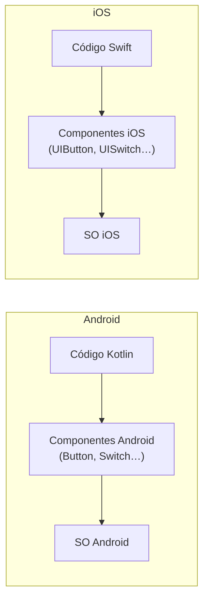
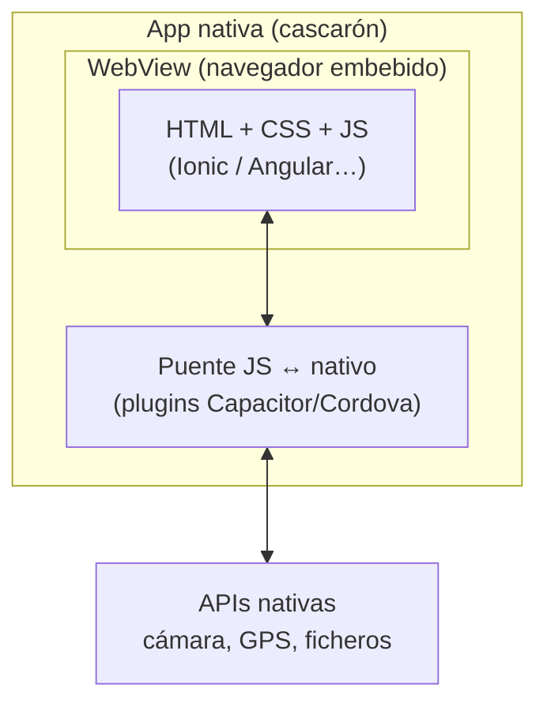
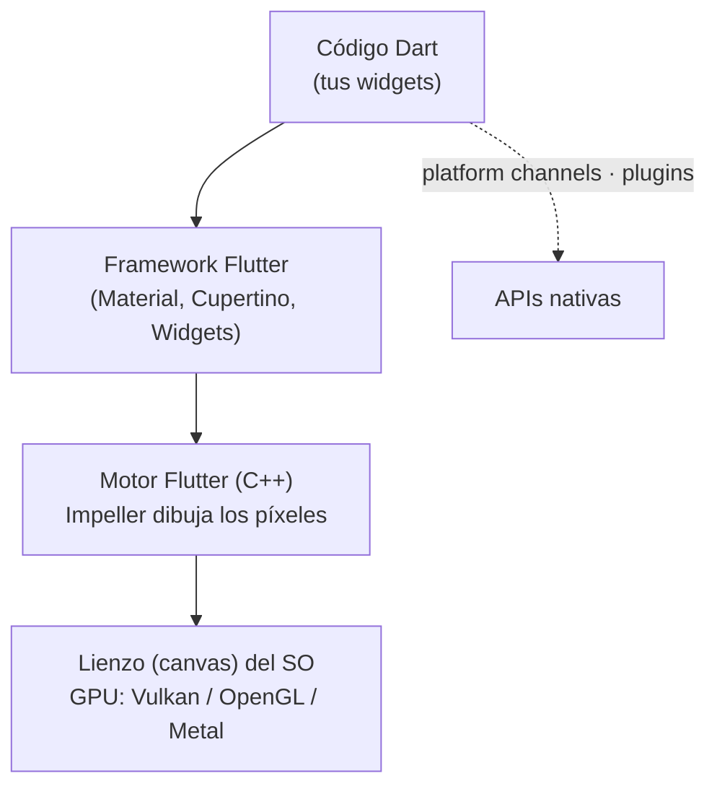
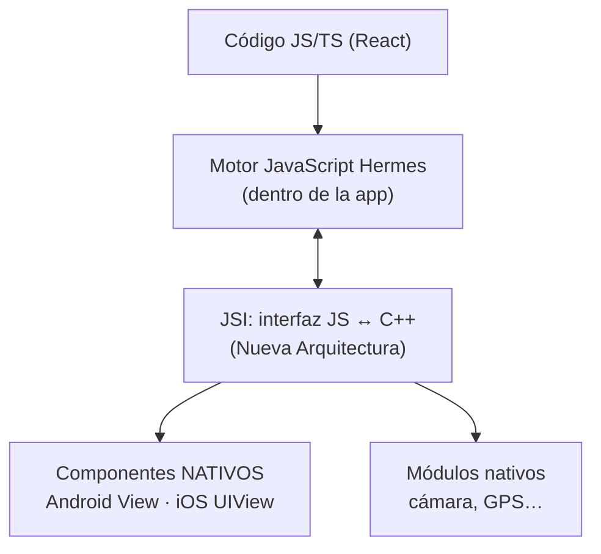

# Cuatro formas de hacer una app

Para comparar enfoques vamos a hacernos siempre **las mismas tres preguntas**:

1. **¿En qué se ejecuta mi código?** (código máquina, un navegador, un motor de JavaScript…)
2. **¿Quién dibuja los botones?** (el sistema operativo, un navegador, el propio framework)
3. **¿Cómo llego a la cámara, el GPS…?** (directamente, a través de un puente, con plugins)

## 1. Nativo

Una app por plataforma, cada una con el lenguaje y el SDK oficiales.

| | Android | iOS |
|---|---|---|
| Lenguaje | Kotlin (o Java) | Swift (u Objective-C) |
| UI | Jetpack Compose / Views | SwiftUI / UIKit |
| IDE | Android Studio | Xcode (solo en macOS) |

- **Código:** compilado para la plataforma (bytecode ART en Android; código máquina en iOS).
- **Botones:** los del sistema operativo.
- **Hardware:** acceso directo a todas las APIs, desde el primer día que salen.

**Ventajas:** máximo rendimiento, aspecto 100 % de la plataforma, acceso inmediato a cualquier novedad del SO.
**Inconvenientes:** **dos equipos, dos códigos, dos veces los errores**. Coste de desarrollo y mantenimiento casi doble.

!!! info "Ya lo conoces (DI y PMDM)"
    Es lo que hacéis con Kotlin + Compose. No entramos más.

## 2. Híbrido clásico (WebView)

Se hace una **aplicación web** (HTML, CSS, JavaScript) y se mete dentro de una app nativa "cascarón" que solo contiene un **WebView**: un navegador sin barra de direcciones que ocupa toda la pantalla.

**Tecnologías:** Apache Cordova (el pionero; PhoneGap, su distribución comercial, se abandonó en 2020), **Capacitor** (su sucesor moderno) e **Ionic** (biblioteca de componentes web con aspecto móvil que se usa con Angular, React o Vue, normalmente sobre Capacitor).

- **Código:** JavaScript ejecutado por el motor del navegador del sistema.
- **Botones:** son **HTML con CSS** que imitan a los nativos.
- **Hardware:** a través de un **puente**: el JavaScript llama a un plugin, el plugin ejecuta código nativo y devuelve el resultado al JavaScript.

**Ventajas:** reutiliza conocimientos y código web; una sola base de código para Android, iOS y web; curva de aprendizaje baja para quien ya sabe web.
**Inconvenientes:** rendimiento limitado por el WebView (listas largas, animaciones complejas); la interfaz "se nota" web; depende de la versión del WebView del dispositivo; cada acceso nativo cruza un puente.

!!! note "Por qué este módulo cambió de Ionic a Flutter"
    Hasta el curso pasado este módulo usaba Ionic + Angular. El enfoque WebView sigue siendo válido (y muy usado en apps internas de empresa), pero el mercado multiplataforma se ha desplazado hacia frameworks que no dependen de un navegador.

## 3. Multiplataforma compilado (Flutter)

Un único código en **Dart** que se **compila a código máquina nativo** (ARM en móviles). Pero, y aquí está el matiz, **no usa los componentes del sistema**: Flutter trae su propio motor gráfico y **dibuja cada píxel él mismo**.

- **Código:** código máquina nativo (compilación AOT en la versión final).
- **Botones:** **los dibuja Flutter**. El sistema operativo solo le presta un lienzo en blanco.
- **Hardware:** mediante **plugins** que usan *platform channels* (mensajes Dart ↔ Kotlin/Swift) o FFI (llamadas directas a C).

**Ventajas:** rendimiento cercano al nativo (60-120 fps); **aspecto idéntico** en todas las plataformas; un código para móvil, web y escritorio; hot reload.
**Inconvenientes:** el aspecto no es el nativo "de verdad" salvo que lo imites; apps algo más grandes (llevan el motor dentro); las novedades del SO llegan cuando alguien escribe el plugin; hay que aprender Dart.

Lo vemos a fondo en [Flutter por dentro](02-flutter-por-dentro.md).

## 4. Multiplataforma interpretado (React Native)

Un único código en **JavaScript/TypeScript** con React. La diferencia con Flutter es de fondo: el código **no se compila a código máquina** sino que lo ejecuta un **motor de JavaScript** (Hermes) dentro de la app, y **sí usa los componentes nativos**: un `<Button>` de React Native acaba siendo un botón real de Android o de iOS.

- **Código:** JavaScript ejecutado por Hermes (que lo precompila a *bytecode*, no a código máquina).
- **Botones:** **los del sistema operativo**. React Native los crea y los gestiona desde JS.
- **Hardware:** módulos nativos accesibles desde JS. En la **Nueva Arquitectura** (por defecto desde 2024) la comunicación es directa mediante JSI; antes pasaba por un "puente" asíncrono que serializaba mensajes en JSON y era el gran cuello de botella.

**Ventajas:** aspecto nativo real; enorme ecosistema JavaScript/npm; comparte conocimientos (y parte del código) con React web; mucha demanda de empleo.
**Inconvenientes:** la lógica corre en un motor de JS, no en código máquina; el aspecto puede **diferir** entre Android e iOS (porque usa los componentes de cada uno); dependencias nativas que se rompen entre versiones.

## Las tres preguntas, resumidas

| | ¿En qué se ejecuta el código? | ¿Quién dibuja los botones? | ¿Cómo llega al hardware? |
|---|---|---|---|
| **Nativo** | Bytecode ART / código máquina | El SO | Directo |
| **WebView** (Ionic) | Motor JS del navegador | HTML + CSS en el WebView | Puente + plugins |
| **Compilado** (Flutter) | **Código máquina** | **El propio Flutter** | Platform channels / FFI |
| **Interpretado** (React Native) | Motor JS (Hermes) | **El SO** | JSI / módulos nativos |

!!! tip "La frase para el examen"
    **Flutter** es nativo en *ejecución* pero no en *widgets*. **React Native** es nativo en *widgets* pero no en *ejecución*. **Ionic** no es nativo en ninguna de las dos.

## Y la PWA, ¿qué es?

Una **Progressive Web App** es una web que se puede "instalar" desde el navegador, funciona sin conexión y puede enviar notificaciones. **No es una app de tienda** (aunque hay formas de empaquetarla) y su acceso al hardware depende de lo que permita el navegador (muy limitado en iOS). Es la opción de coste mínimo cuando la app es básicamente contenido.

!!! example "Ejercicio 1.1 · ¿Quién dibuja el botón?"
    Para cada frase, di a qué enfoque se refiere (puede haber más de uno):

    1. "Un cambio en el aspecto del `Switch` en la nueva versión de Android se ve automáticamente en mi app sin recompilar."
    2. "Mi app se ve igual en un Samsung que en un iPhone, píxel a píxel."
    3. "Si el móvil tiene un WebView antiguo, mi app va lenta."
    4. "Cada vez que leo el GPS, mi código cruza de un lenguaje a otro."
    5. "Necesito un Mac para compilar la versión de iOS."
