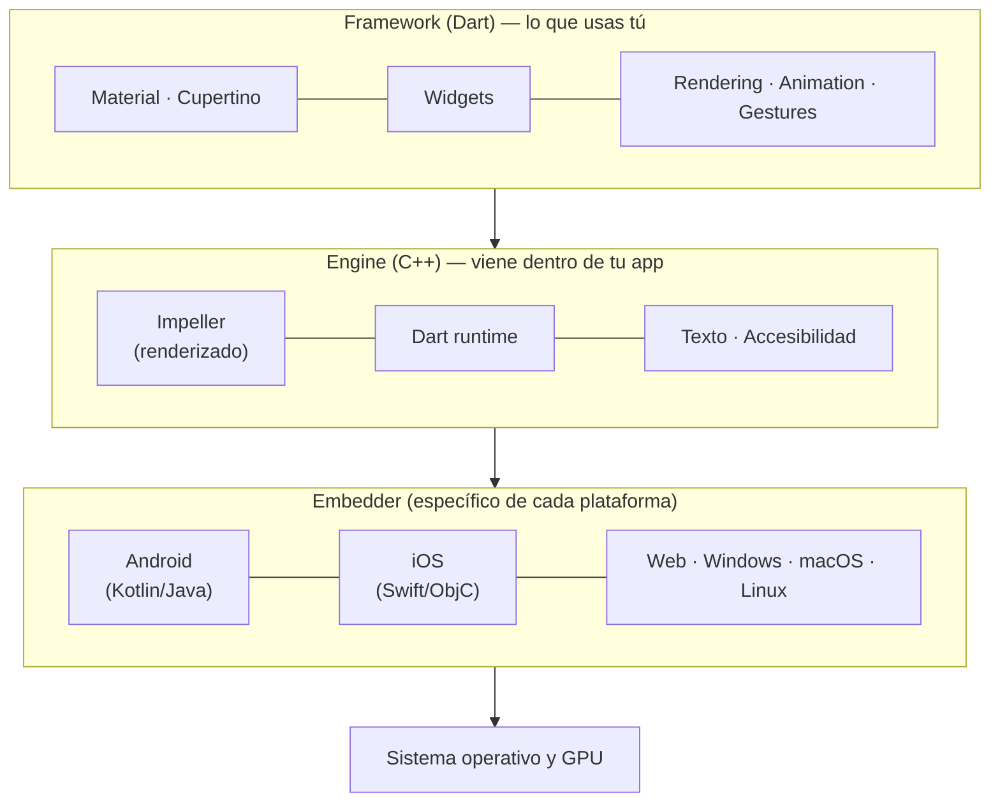
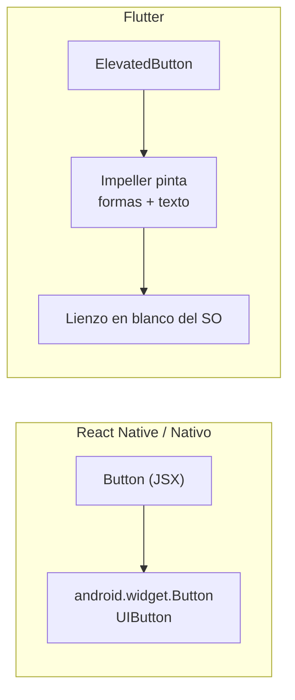
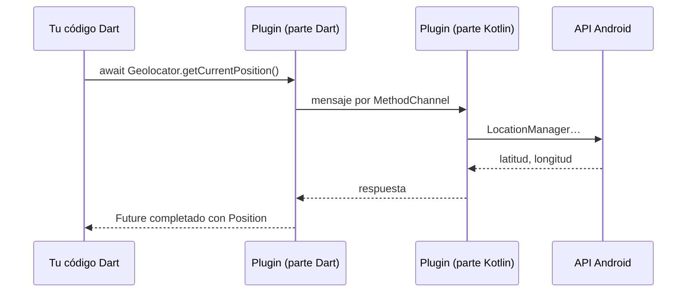

# Flutter por dentro

## Las tres capas

Flutter está construido en capas. Tú escribes en la de arriba; las de abajo las pone Flutter.



| Capa | Lenguaje | Qué hace |
|---|---|---|
| **Framework** | Dart | Los widgets (`Text`, `Column`, `Scaffold`…), los estilos Material y Cupertino, gestos, animaciones y el cálculo del *layout* |
| **Engine** | C++ | Dibuja en la GPU con **Impeller**, ejecuta Dart, maquetación de texto, accesibilidad |
| **Embedder** | El de cada plataforma | Crea la ventana/actividad, entrega eventos táctiles, ciclo de vida, acceso a plugins. En Android es una `Activity` normal |

!!! info "Ya lo conoces (PMDM)"
    El *embedder* de Android es una `Activity` como las que conocéis. Por eso una app Flutter se instala, se depura con ADB y se ejecuta en los mismos AVD que una app nativa.

## Nativo en ejecución…

| Modo | Compilación | Para qué |
|---|---|---|
| **Debug** | **JIT** (*just in time*) sobre una máquina virtual de Dart | Desarrollo. Permite el **hot reload**: inyectar código nuevo sin reiniciar |
| **Profile** | AOT con herramientas de medición | Medir rendimiento (RA3) |
| **Release** | **AOT** (*ahead of time*) a código máquina ARM/x64 | La app que se publica. Sin máquina virtual, sin intérprete |

En release, tu código Dart es **código máquina nativo**, igual que una app en C++. Por eso Flutter es "nativo en ejecución".

!!! warning "No midas el rendimiento en debug"
    En modo debug la app va más lenta a propósito (JIT, comprobaciones extra). Si parece lenta, pruébala con `flutter run --release` antes de sacar conclusiones.

## …pero NO nativo en widgets

Este es **el matiz clave del tema**.

Cuando escribes en Flutter:

```dart
ElevatedButton(onPressed: () {}, child: const Text('Aceptar'))
Switch(value: true, onChanged: (_) {})
```

**No** se crea un `Button` de Android ni un `UISwitch` de iOS. El sistema operativo le da a Flutter **un lienzo vacío** y el motor **dibuja** el botón: el rectángulo, la sombra, el texto, la animación al pulsarlo. Todo son píxeles pintados por Impeller.



### Consecuencias

| Consecuencia | Por qué |
|---|---|
| ✅ **Se ve idéntico** en Android, iOS, web y escritorio | El mismo motor pinta lo mismo en todas partes |
| ✅ **No depende de la versión del SO** para el aspecto | Un Android 10 y un Android 16 ven el mismo botón |
| ✅ Libertad total de diseño | Si puedes dibujarlo, puedes hacerlo widget |
| ⚠️ No es el aspecto nativo "real" | Material y Cupertino son **imitaciones** muy fieles del estilo de Google y de Apple |
| ⚠️ Las novedades visuales del SO no llegan solas | Si Apple rediseña sus controles, Flutter tiene que redibujar los suyos |
| ⚠️ Accesibilidad y texto los gestiona Flutter | Mantiene un "árbol semántico" paralelo para que TalkBack/VoiceOver sepan qué hay en pantalla |

!!! tip "Si quieres aspecto de cada plataforma"
    Hay widgets *adaptativos* (`Switch.adaptive`, `CircularProgressIndicator.adaptive`…) que se dibujan como Material en Android y como Cupertino en iOS. Y si necesitas un componente **realmente** nativo (un mapa, un WebView), Flutter puede incrustarlo con *platform views*.

## Impeller

**Impeller** es el motor de renderizado actual de Flutter. Sustituye a Skia (el que se usaba antes, el mismo que usa Chrome) y es el motor por defecto en iOS y en Android moderno; en algunos dispositivos Android antiguos Flutter todavía puede recurrir a Skia.

La mejora principal: **precompila los *shaders*** (los programas que ejecuta la GPU). Con Skia, la primera vez que aparecía una animación había que compilarlos en ese momento y la app daba un tirón (*jank*). Impeller lo deja hecho al compilar la app.

## Acceso al hardware: plugins y platform channels

Como Dart no puede llamar directamente al SDK de Android o iOS, el acceso a la cámara, GPS, etc. se hace con **plugins**: paquetes que tienen una parte en Dart y otra en Kotlin/Swift, comunicadas por un **platform channel** (paso de mensajes).



Fíjate: **es un `Future`**. Por eso el Tema 1 insistía tanto en `async`/`await`. Los plugins se instalan desde [pub.dev](https://pub.dev), el repositorio oficial de paquetes de Dart y Flutter. Lo trabajaremos en RA2.

## Más allá del móvil

| Plataforma | Cómo compila |
|---|---|
| Android / iOS | Código máquina ARM (AOT) |
| Web | JavaScript o **WebAssembly**, dibujando en un `<canvas>` |
| Windows / macOS / Linux | Código máquina x64/ARM |

!!! example "Ejercicio 1.2 · Compruébalo tú"
    Ejecuta la app «Hola, plataformas» del [Tema 1](../tema1/index.md) en el emulador y activa en Android **Opciones de desarrollador → Mostrar límites de diseño**. Compara una app nativa (Ajustes) con la app Flutter. ¿Qué ves? ¿Por qué?
