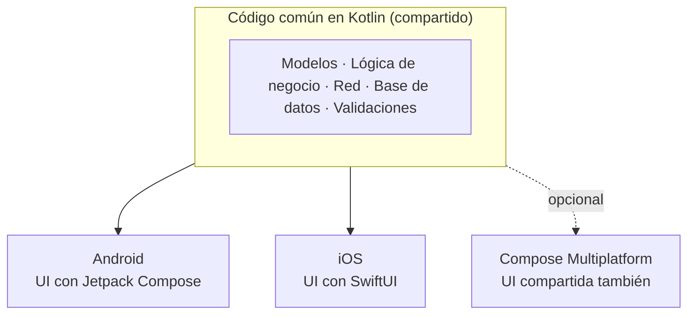

# Kotlin Multiplatform: la tercera vía

Hasta ahora hemos visto dos extremos: **compartirlo todo** (Flutter, React Native, Ionic) o **no compartir nada** (nativo). **Kotlin Multiplatform (KMP)**, de JetBrains, propone un punto intermedio: **compartir la lógica y dejar la interfaz nativa**.



## Cómo funciona

- El código común se escribe en **Kotlin**.
- Para Android se compila a **bytecode de la JVM/ART**, como cualquier app Android.
- Para iOS se compila con **Kotlin/Native** a **código máquina** y se entrega como un *framework* que Swift puede usar directamente.
- Lo que depende de la plataforma se declara con `expect` en el código común y se implementa con `actual` en cada plataforma.

```kotlin
// commonMain
expect fun nombrePlataforma(): String

// androidMain
actual fun nombrePlataforma() = "Android ${android.os.Build.VERSION.SDK_INT}"

// iosMain
actual fun nombrePlataforma() = UIDevice.currentDevice.systemName()
```

## Las dos formas de usar KMP

| | KMP "clásico" | KMP + Compose Multiplatform |
|---|---|---|
| **Lógica** | Compartida | Compartida |
| **Interfaz** | Nativa en cada plataforma (Compose en Android, SwiftUI en iOS) | **Compartida** con Compose |
| **Aspecto** | 100 % nativo | Idéntico en todas (lo dibuja Compose, como Flutter) |
| **Equipo** | Necesita saber Kotlin **y** Swift | Basta con Kotlin |

**Compose Multiplatform** (de JetBrains) lleva Jetpack Compose a iOS, escritorio y web. Su soporte para **iOS es estable desde 2025**. Funciona como Flutter: dibuja la interfaz con su propio motor (Skia) en lugar de usar los componentes de iOS.

## Las tres preguntas

| ¿En qué se ejecuta el código? | ¿Quién dibuja los botones? | ¿Cómo llega al hardware? |
|---|---|---|
| Bytecode ART (Android) / código máquina (iOS) | El SO (KMP clásico) o Compose (Compose Multiplatform) | **Directo**: Kotlin llama al SDK de cada plataforma con `actual` |

## Ventajas e inconvenientes

**Ventajas**

- Se puede **adoptar poco a poco** en una app nativa existente: empiezas compartiendo solo los modelos y la red.
- Interfaz 100 % nativa si se quiere.
- Acceso directo a las APIs de la plataforma, sin puentes.
- Para equipos Android que ya usan Kotlin y Compose, la curva es mínima.

**Inconvenientes**

- En la versión "clásica" sigue habiendo **dos interfaces** que mantener.
- Ecosistema de bibliotecas multiplataforma más pequeño que el de Flutter o React Native.
- Para iOS sigue haciendo falta conocer Xcode y, a menudo, Swift.

!!! question "¿Y por qué no damos KMP en este módulo?"
    Porque la mitad del grupo viene de 1º **solo con Java**: KMP le daría ventaja a la otra mitad. Además, Compose ya se trabaja en DI. Lo estudiamos como **alternativa** que un DAM debe conocer y saber valorar. Ver la [decisión tecnológica](../modulo/decision-tecnologica.md).

!!! example "Ejercicio 1.3 · ¿Dónde pondrías cada cosa?"
    En una app de reservas del Gran Teatro Falla hecha con KMP clásico, clasifica cada elemento en **común**, **Android** o **iOS**:
    validación del DNI · pantalla de selección de butacas · llamada a la API de reservas · notificación push · caché de la programación · pago con Apple Pay · modelo `Espectaculo`.
