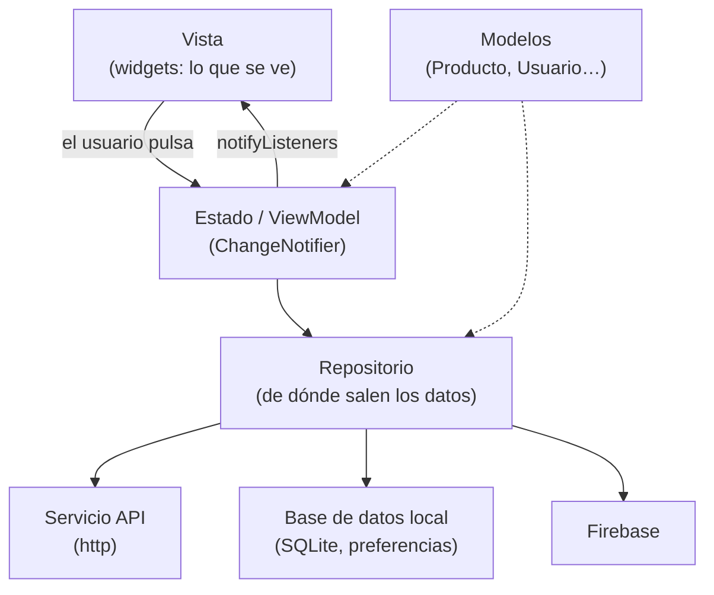

# Diseñar la app: patrones, estructura y mobile-first

Elegir la tecnología es solo la primera decisión. Antes de escribir código hay que decidir **cómo se organiza la app por dentro** y **cómo se verá en cada tamaño de pantalla**.

!!! abstract "Criterios de este apartado"
    - **RA1 b:** evaluar arquitecturas y patrones de diseño según los requisitos.
    - **RA1 d:** diseñar la estructura de la app con criterios de usabilidad, rendimiento y adaptabilidad.
    - **RA1 e:** aplicar diseño responsive y mobile-first.

## 1. Patrones de arquitectura

### Separar en capas

Una app que mezcla en el mismo widget la interfaz, las llamadas a la API y las reglas de negocio funciona… hasta que hay que cambiar algo. La idea básica es **separar responsabilidades**:



| Capa | Responsabilidad | Ejemplo en Flutter |
|---|---|---|
| **Vista** | Pintar y recoger lo que hace el usuario. Nada de lógica | `PantallaCatalogo`, `TarjetaProducto` |
| **Estado (ViewModel)** | Guardar el estado de la pantalla y decidir qué hacer ante cada acción | `class CatalogoViewModel extends ChangeNotifier` |
| **Repositorio** | Ofrecer los datos sin que la vista sepa si vienen de internet, del móvil o de Firebase | `RepositorioProductos` |
| **Servicios** | Hablar con una fuente concreta | `ServicioApi`, `BaseDatosLocal` |
| **Modelos** | Representar los datos | `Producto` con `fromJson` / `toJson` |

!!! info "Ya lo conoces (DI)"
    Es el patrón **MVVM** que se usa con Jetpack Compose: la vista observa un `ViewModel`. En Flutter el `ViewModel` suele ser un `ChangeNotifier` y la vista lo observa con `provider`. La [guía oficial de arquitectura de Flutter](https://docs.flutter.dev/app-architecture) recomienda exactamente esto: MVVM con repositorios y servicios.

### Otros patrones que vais a usar sin daros cuenta

| Patrón | Qué resuelve | Dónde aparece en el módulo |
|---|---|---|
| **Observer** | Avisar a quien le interese cuando algo cambia | `ChangeNotifier`, `Stream`, `StreamBuilder` |
| **Repository** | Aislar el origen de los datos | Tema 5: la misma lista puede venir de la API o de SQLite |
| **Factory** | Crear objetos a partir de otros datos | `Producto.fromJson(...)` |
| **Inyección de dependencias** | Pasar a una clase lo que necesita en lugar de que lo cree ella | `ServicioTerremotos(cliente: ...)` en el Tema 6, `provider` |
| **Singleton** | Una única instancia compartida | `FirebaseAuth.instance`, `SharedPreferences` |

### ¿Qué arquitectura según los requisitos?

No todas las apps necesitan lo mismo. Sobrediseñar una app pequeña es tan mal diseño como no diseñar una grande.

| Tamaño y requisitos | Arquitectura razonable |
|---|---|
| App pequeña, una o dos pantallas, sin datos compartidos | Widgets con `setState` |
| App mediana, estado compartido entre pantallas, una fuente de datos | **MVVM** con `ChangeNotifier` + `provider` y servicios (lo que usamos en el módulo) |
| App grande, varios equipos, muchas fuentes de datos, funcionamiento sin conexión | MVVM con repositorios, capas bien separadas y soluciones de estado más potentes (Riverpod, Bloc) |

Y según el enfoque tecnológico del apartado anterior:

| Enfoque | Patrón habitual |
|---|---|
| Nativo Android | MVVM con `ViewModel` + Compose |
| Ionic / Angular | Componentes + servicios inyectados |
| React Native | Componentes + *hooks*; Redux o Zustand para estado global |
| Flutter | Widgets + `ChangeNotifier`/`provider`, Riverpod o Bloc |
| Kotlin Multiplatform | `ViewModel` y repositorios **compartidos** en Kotlin, vistas nativas |

## 2. Estructura del proyecto

Una estructura por capas, suficiente para todas las prácticas del módulo:

```text
lib/
├── main.dart               ← arranque, tema y providers
├── modelos/                ← Producto, Cliente… (fromJson / toJson)
├── servicios/              ← ServicioApi, BaseDatosLocal
├── repositorios/           ← RepositorioProductos
├── estado/                 ← CarritoViewModel, CatalogoViewModel (ChangeNotifier)
├── pantallas/              ← una pantalla por fichero
└── widgets/                ← piezas reutilizables (TarjetaProducto…)
```

!!! tip "Por capas o por funcionalidad"
    En apps grandes se organiza **por funcionalidad** (`catalogo/`, `carrito/`, `perfil/`), cada una con sus propias capas dentro. Para el tamaño de vuestras prácticas, por capas es más claro.

## 3. Criterios de diseño: usabilidad, rendimiento y adaptabilidad

### Usabilidad

| Criterio | En la práctica |
|---|---|
| **Objetivos táctiles grandes** | Mínimo **48 × 48 dp** para cualquier cosa pulsable (guía de Material Design) |
| **Respuesta inmediata** | Indicador de carga en toda operación que tarde; `SnackBar` al guardar o borrar |
| **Navegación predecible** | 3 a 5 destinos en la barra de navegación; pocos niveles de profundidad; el botón atrás siempre funciona |
| **Coherencia** | Mismos colores, iconos y textos para las mismas acciones. Usa el tema, no colores sueltos |
| **Estados vacíos y de error** | Qué se ve cuando no hay datos o falla la red (no una pantalla en blanco) |
| **Accesibilidad** | Contraste suficiente, textos que crecen si el usuario aumenta la letra del sistema, etiquetas para lectores de pantalla |

### Rendimiento desde el diseño

Muchos problemas de rendimiento se deciden en el diseño, no en el código:

- **Listas largas** siempre con carga perezosa (`ListView.builder`) y, si hay muchos datos, paginadas.
- **Imágenes** del tamaño en que se muestran; miniaturas en las listas.
- **No pedir todo al abrir la app**: cargar lo que se ve y el resto bajo demanda.
- **Pensar en la mala conexión**: caché local y mensajes claros.

### Adaptabilidad a diferentes dispositivos

Una app multiplataforma se usará en un móvil con una mano, en una tablet en horizontal y en un monitor con ratón y teclado. Hay que decidir **en el diseño** qué cambia en cada caso: distribución, navegación, tamaño de los elementos y forma de interactuar (toque o ratón).

## 4. Mobile-first y diseño responsive

### Mobile-first

**Se diseña primero la pantalla más pequeña**, con solo lo esencial, y después se decide qué se añade o reorganiza cuando hay más espacio. Al revés (diseñar para escritorio y "encoger") acaba en pantallas móviles abarrotadas.

### Responsive frente a adaptativo

| | Responsive | Adaptativo |
|---|---|---|
| Qué hace | El **mismo** diseño se estira y se reorganiza | Cambia **los componentes** según el dispositivo |
| Ejemplo | La cuadrícula pasa de 2 a 5 columnas | La barra de navegación inferior pasa a ser un menú lateral |
| Lo normal | Se combinan los dos | |

### Puntos de corte

Material Design clasifica las ventanas por su ancho (*window size classes*):

| Clase | Ancho | Dispositivo típico | Navegación recomendada |
|---|---|---|---|
| **Compacta** | < 600 dp | Móvil en vertical | `NavigationBar` abajo |
| **Media** | 600 – 839 dp | Tablet vertical, plegable abierto | `NavigationRail` a la izquierda |
| **Expandida** | ≥ 840 dp | Tablet horizontal, escritorio, web | `NavigationRail` o menú lateral fijo |

### Cómo se hace en Flutter

| Herramienta | Para qué |
|---|---|
| `LayoutBuilder` | Saber el ancho disponible y construir una cosa u otra |
| `MediaQuery.sizeOf(context)` | Tamaño de la pantalla completa |
| `Expanded`, `Flexible`, `Wrap` | Repartir el espacio y saltar de línea |
| `GridView` con `SliverGridDelegateWithMaxCrossAxisExtent` | Tantas columnas como quepan de un ancho máximo |
| `ConstrainedBox(constraints: BoxConstraints(maxWidth: 700))` | Que un texto largo no ocupe 1900 px de ancho en un monitor |
| `SafeArea` | Evitar la muesca y las barras del sistema |

Un esqueleto **adaptativo** que cambia de navegación según el ancho:

```dart
import 'package:flutter/material.dart';

class EsqueletoAdaptable extends StatefulWidget {
  const EsqueletoAdaptable({super.key});
  @override
  State<EsqueletoAdaptable> createState() => _EsqueletoAdaptableState();
}

class _EsqueletoAdaptableState extends State<EsqueletoAdaptable> {
  int _indice = 0;

  static const _pantallas = [
    Center(child: Text('Catálogo')),
    Center(child: Text('Carrito')),
    Center(child: Text('Perfil')),
  ];

  void _ir(int i) => setState(() => _indice = i);

  @override
  Widget build(BuildContext context) {
    return LayoutBuilder(
      builder: (context, constraints) {
        // Compacta: móvil → barra inferior
        if (constraints.maxWidth < 600) {
          return Scaffold(
            body: _pantallas[_indice],
            bottomNavigationBar: NavigationBar(
              selectedIndex: _indice,
              onDestinationSelected: _ir,
              destinations: const [
                NavigationDestination(icon: Icon(Icons.store), label: 'Catálogo'),
                NavigationDestination(icon: Icon(Icons.shopping_cart), label: 'Carrito'),
                NavigationDestination(icon: Icon(Icons.person), label: 'Perfil'),
              ],
            ),
          );
        }
        // Media y expandida: tablet, escritorio, web → menú lateral
        return Scaffold(
          body: Row(
            children: [
              NavigationRail(
                selectedIndex: _indice,
                onDestinationSelected: _ir,
                extended: constraints.maxWidth >= 840,   // con texto si hay sitio
                destinations: const [
                  NavigationRailDestination(icon: Icon(Icons.store), label: Text('Catálogo')),
                  NavigationRailDestination(icon: Icon(Icons.shopping_cart), label: Text('Carrito')),
                  NavigationRailDestination(icon: Icon(Icons.person), label: Text('Perfil')),
                ],
              ),
              const VerticalDivider(width: 1),
              Expanded(child: _pantallas[_indice]),
            ],
          ),
        );
      },
    );
  }
}
```

!!! tip "Cómo probarlo"
    Ejecútalo en **Chrome** o en **escritorio** y cambia el tamaño de la ventana: la barra de abajo se convierte en menú lateral al pasar de 600 píxeles, y el menú muestra los textos al pasar de 840. En el emulador de Android puedes crear un AVD de tablet o de plegable.

## 5. Bocetos (wireframes)

Antes de programar, se dibuja. Un boceto es un esquema en blanco y negro de cada pantalla: qué hay y dónde, sin colores ni detalles.

- **Herramientas:** papel y lápiz (lo más rápido), [Excalidraw](https://excalidraw.com), [Penpot](https://penpot.app) o Figma.
- **Mobile-first:** primero el boceto compacto (móvil) y después el expandido (escritorio), marcando qué cambia.

!!! example "Ejercicio 1.4 · Diseña Cádiz Market antes de programarlo"
    En el Tema 3 programaréis **Cádiz Market**, una tienda con catálogo, detalle de producto, carrito y clientes. Antes:

    1. Dibuja los bocetos del **catálogo** y del **carrito** en versión móvil y en versión escritorio. Marca qué cambia (columnas, navegación, qué se muestra a la vez).
    2. Escribe la **estructura de carpetas** de `lib/` y qué clases iría en cada una.
    3. Indica qué **patrones** usarías (por ejemplo, dónde está el Observer) y por qué esa arquitectura y no otra más sencilla o más compleja.
    4. Lista **tres decisiones de usabilidad** concretas (por ejemplo: «el botón de añadir al carrito se desactiva sin stock»).

    Guárdalo: te servirá para la Práctica 3.1.
