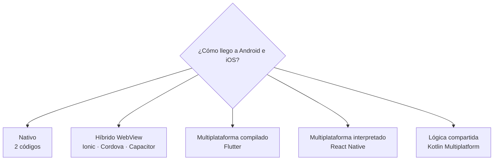

# Tema 2 · Arquitectura y diseño de apps multiplataforma

!!! abstract "Ficha del tema"
    - **Duración:** 1 sesión (+ trabajo en casa)
    - **RA:** **RA1 completo** (CE a, b, c, d, e). El CE e se refuerza en el Tema 3
    - **Entrega:** [Práctica · Informe de arquitectura](practica.md)

!!! info "Ya lo conoces (PMDM)"
    Sistemas operativos móviles, capas del SO, arquitectura Android, emuladores, ADB y una visión general de cómo elegir tecnología. **No lo repetimos.** Aquí bajamos al detalle: *qué pasa por dentro* de cada tipo de app multiplataforma.

## La pregunta del tema

Tienes que hacer una app para Android **y** iOS. ¿La escribes dos veces? ¿La haces web y la metes en una app? ¿Usas un framework que compile a las dos? Cada respuesta tiene una **arquitectura** distinta, y eso decide su rendimiento, su aspecto y cuánto cuesta mantenerla.

## Ruta del tema

| Página | Qué aprendes |
|---|---|
| [Cuatro formas de hacer una app](01-enfoques.md) | Nativo, WebView, compilado e interpretado: cómo ejecuta el código y cómo pinta la pantalla cada uno |
| [Flutter por dentro](02-flutter-por-dentro.md) | Capas de Flutter, Impeller, AOT/JIT. **Nativo en ejecución, no en widgets** |
| [Kotlin Multiplatform: la tercera vía](03-kmp.md) | Compartir lógica y dejar la UI nativa (o no) |
| [Elegir con criterio](04-comparativa.md) | Tabla comparativa y casos prácticos |
| [Diseñar la app](05-diseno.md) | Patrones (MVVM, repositorio), estructura del proyecto, usabilidad, mobile-first y responsive |
| [Práctica](practica.md) | Entregable |

## Objetivos

- [x] Explicar cómo se ejecuta el código y cómo se dibuja la interfaz en cada enfoque.
- [x] Explicar por qué Flutter es nativo en ejecución pero no en widgets.
- [x] Situar Kotlin Multiplatform frente al resto.
- [x] Elegir y justificar una tecnología para un caso concreto.
- [x] Diseñar la estructura de una app (capas, carpetas, patrones) y sus bocetos mobile-first.
