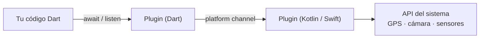

# Tema 4 · Funcionalidades nativas del dispositivo

!!! abstract "Ficha del tema"
    - **Duración:** 1 sesión (23 de noviembre) + trabajo en casa
    - **RA:** RA2 · CE b (acceso a características nativas: cámara, geolocalización, sensores…) · CE c (ciclo de vida de la app)
    - **Actividades:** [9 ejercicios rápidos de clase](#ejercicios-rapidos) · 1 guiado · [Boletín de 9 ejercicios](#boletin-de-ejercicios) · [Práctica 4.1 · GPS con IA](#practica-41-gps-con-ia) · [Práctica 4.2 · Eureka](#practica-42-eureka)

!!! warning "Trae tu móvil Android"
    El emulador simula GPS y algo de acelerómetro, pero **no tiene cámara real, sensor de luz ni linterna**. Para este tema necesitas un móvil Android con la depuración USB activada (PMDM) o compartir el de un compañero.

---

## 1. Cómo llega Flutter al hardware

Lo visteis en el Tema 2: Dart no puede llamar directamente al SDK de Android o iOS. Se usa un **plugin**: un paquete con una parte en Dart y otra en Kotlin/Swift que se comunican por un *platform channel*. Para ti, un plugin es **una función que devuelve un `Future` o un `Stream`**.



### Buscar e instalar plugins

1. Busca en [pub.dev](https://pub.dev). Fíjate en: **plataformas soportadas**, *likes*, *pub points*, fecha de la última versión y si es un *Flutter Favorite* o de *flutter.dev* / *fluttercommunity.dev*.
2. Instálalo desde la carpeta del proyecto:

    ```bash
    flutter pub add geolocator
    ```

3. **Lee la sección *Setup* del README**: casi todos piden añadir permisos en Android o iOS.
4. Tras añadir un plugin con código nativo, **para la app y vuelve a lanzarla** (el hot reload no basta).

| Plugin | Para qué | Plataformas |
|---|---|---|
| `geolocator` | Posición GPS, única o continua | Android, iOS, web, escritorio |
| `permission_handler` | Pedir y consultar cualquier permiso | Android, iOS, Windows, web (parcial) |
| `image_picker` | Hacer una foto o elegirla de la galería | Android, iOS, web, escritorio |
| `camera` | Vista previa de la cámara dentro de la app | Android, iOS, web |
| `sensors_plus` | Acelerómetro, giroscopio, magnetómetro | Android, iOS, web |
| `light` | Sensor de luz | **Solo Android** |
| `torch_light` | Linterna | Android, iOS |
| `audioplayers` | Reproducir audio | Todas |
| `url_launcher` | Abrir web, llamar, mapas, email | Todas |
| `share_plus` | Compartir con otras apps | Todas |
| `battery_plus`, `connectivity_plus`, `device_info_plus` | Batería, red, información del dispositivo | Todas |
| `flutter_local_notifications` | Notificaciones locales | Android, iOS, macOS, Linux, Windows |

!!! warning "Comprueba las versiones al empezar"
    Los plugins evolucionan. Si un ejemplo de esta página no compila, mira el *Example* de la página del plugin en pub.dev: es la referencia actualizada.

---

## 2. Permisos

Dos niveles, y hacen falta **los dos**:

1. **Declararlo** en la configuración nativa (si no, el sistema ni siquiera pregunta).
2. **Pedirlo en ejecución** (el diálogo «¿Permitir que la app acceda a tu ubicación?»).

=== "Android"

    En `android/app/src/main/AndroidManifest.xml`, **antes** de `<application`:

    ```xml
    <uses-permission android:name="android.permission.INTERNET" />
    <uses-permission android:name="android.permission.ACCESS_FINE_LOCATION" />
    <uses-permission android:name="android.permission.ACCESS_COARSE_LOCATION" />
    <uses-permission android:name="android.permission.CAMERA" />
    ```

=== "iOS"

    En `ios/Runner/Info.plist`, dentro de `<dict>`, un texto que explica **para qué** (Apple rechaza apps sin él):

    ```xml
    <key>NSLocationWhenInUseUsageDescription</key>
    <string>Para mostrar tu posición en el mapa</string>
    <key>NSCameraUsageDescription</key>
    <string>Para hacer fotos de los lugares</string>
    ```

!!! info "Ya lo conoces (PMDM)"
    El sistema de permisos de Android (declarados y en tiempo de ejecución) es el mismo que visteis en PMDM. Lo nuevo es pedirlos **desde Dart**.

Con `permission_handler`:

```dart
import 'package:permission_handler/permission_handler.dart';

Future<bool> pedirCamara() async {
  final estado = await Permission.camera.request();
  if (estado.isGranted) return true;
  if (estado.isPermanentlyDenied) {
    await openAppSettings();      // el usuario lo denegó "para siempre": a Ajustes
  }
  return false;
}
```

!!! tip "Buenas prácticas con permisos"
    - Pide el permiso **justo cuando se necesita** (al pulsar «Hacer foto»), no al abrir la app.
    - Explica **antes** por qué lo necesitas.
    - Si lo deniegan, la app **no puede romperse**: muestra un mensaje y un botón para reintentar.

---

## 3. Ubicación GPS

```bash
flutter pub add geolocator
```

### Posición actual

```dart
import 'package:geolocator/geolocator.dart';

Future<Position> obtenerPosicion() async {
  if (!await Geolocator.isLocationServiceEnabled()) {
    throw Exception('El GPS está desactivado');
  }

  var permiso = await Geolocator.checkPermission();
  if (permiso == LocationPermission.denied) {
    permiso = await Geolocator.requestPermission();
    if (permiso == LocationPermission.denied) {
      throw Exception('Permiso de ubicación denegado');
    }
  }
  if (permiso == LocationPermission.deniedForever) {
    throw Exception('Permiso denegado permanentemente. Actívalo en Ajustes');
  }

  return Geolocator.getCurrentPosition(
    locationSettings: const LocationSettings(accuracy: LocationAccuracy.high),
  );
}
```

### Posición en tiempo real (un `Stream`)

```dart
class Rastreador extends StatefulWidget {
  const Rastreador({super.key});
  @override
  State<Rastreador> createState() => _RastreadorState();
}

class _RastreadorState extends State<Rastreador> {
  StreamSubscription<Position>? _sub;
  Position? _pos;
  String? _error;

  @override
  void initState() {
    super.initState();
    _empezar();
  }

  Future<void> _empezar() async {
    try {
      await obtenerPosicion();                 // comprueba servicio y permisos
      _sub = Geolocator.getPositionStream(
        locationSettings: const LocationSettings(
          accuracy: LocationAccuracy.high,
          distanceFilter: 5,                   // solo avisa si te mueves 5 m
        ),
      ).listen((p) => setState(() => _pos = p));
    } catch (e) {
      setState(() => _error = '$e');
    }
  }

  @override
  void dispose() {
    _sub?.cancel();                            // ¡imprescindible!
    super.dispose();
  }

  @override
  Widget build(BuildContext context) {
    if (_error != null) return Center(child: Text(_error!));
    if (_pos == null) return const Center(child: CircularProgressIndicator());
    return Center(
      child: Text(
        'Lat: ${_pos!.latitude.toStringAsFixed(5)}\n'
        'Lon: ${_pos!.longitude.toStringAsFixed(5)}\n'
        'Precisión: ${_pos!.accuracy.toStringAsFixed(0)} m',
        textAlign: TextAlign.center,
        style: const TextStyle(fontSize: 22),
      ),
    );
  }
}
```

(Necesita `import 'dart:async';` para `StreamSubscription`.)

**Distancia entre dos puntos:**

```dart
final metros = Geolocator.distanceBetween(lat1, lon1, lat2, lon2);
```

!!! tip "GPS en el emulador"
    En el emulador de Android: **⋮ (Extended controls) → Location**. Puedes fijar un punto o reproducir una ruta.

---

## 4. Cámara y galería

Para **hacer o elegir una foto**, lo más sencillo es `image_picker` (abre la app de cámara del sistema):

```bash
flutter pub add image_picker
```

```dart
import 'dart:io';
import 'package:flutter/foundation.dart' show kIsWeb;
import 'package:image_picker/image_picker.dart';

class Foto extends StatefulWidget {
  const Foto({super.key});
  @override
  State<Foto> createState() => _FotoState();
}

class _FotoState extends State<Foto> {
  final _picker = ImagePicker();
  XFile? _foto;

  Future<void> _elegir(ImageSource origen) async {
    final foto = await _picker.pickImage(source: origen, maxWidth: 1200);
    if (foto != null) setState(() => _foto = foto);
  }

  @override
  Widget build(BuildContext context) {
    return Column(
      children: [
        Expanded(
          child: _foto == null
              ? const Center(child: Text('Sin foto'))
              : kIsWeb
                  ? Image.network(_foto!.path)      // en web, path es una URL temporal
                  : Image.file(File(_foto!.path)),
        ),
        Row(
          mainAxisAlignment: MainAxisAlignment.spaceEvenly,
          children: [
            FilledButton.icon(
              onPressed: () => _elegir(ImageSource.camera),
              icon: const Icon(Icons.photo_camera),
              label: const Text('Cámara'),
            ),
            OutlinedButton.icon(
              onPressed: () => _elegir(ImageSource.gallery),
              icon: const Icon(Icons.photo_library),
              label: const Text('Galería'),
            ),
          ],
        ),
      ],
    );
  }
}
```

Para una **vista previa en directo** dentro de la app (como en Eureka) se usa el plugin `camera`: `availableCameras()`, un `CameraController` que se inicializa en `initState` y se libera en `dispose`, y el widget `CameraPreview(controller)`. El ejemplo completo está en su página de pub.dev.

---

## 5. Sensores

```bash
flutter pub add sensors_plus
```

```dart
import 'dart:async';
import 'package:sensors_plus/sensors_plus.dart';

class Nivel extends StatefulWidget {
  const Nivel({super.key});
  @override
  State<Nivel> createState() => _NivelState();
}

class _NivelState extends State<Nivel> {
  StreamSubscription<AccelerometerEvent>? _sub;
  double _x = 0, _y = 0, _z = 0;

  @override
  void initState() {
    super.initState();
    _sub = accelerometerEventStream().listen((e) {
      setState(() {
        _x = e.x;
        _y = e.y;
        _z = e.z;
      });
    });
  }

  @override
  void dispose() {
    _sub?.cancel();
    super.dispose();
  }

  @override
  Widget build(BuildContext context) {
    final plano = _x.abs() < 0.5 && _y.abs() < 0.5;
    return Center(
      child: Column(
        mainAxisSize: MainAxisSize.min,
        children: [
          Text('x: ${_x.toStringAsFixed(2)}  y: ${_y.toStringAsFixed(2)}  z: ${_z.toStringAsFixed(2)}'),
          const SizedBox(height: 24),
          Icon(plano ? Icons.check_circle : Icons.screen_rotation,
              size: 96, color: plano ? Colors.green : Colors.orange),
          Text(plano ? '¡Está nivelado!' : 'Inclínalo hasta ponerlo plano'),
        ],
      ),
    );
  }
}
```

| Stream de `sensors_plus` | Qué mide |
|---|---|
| `accelerometerEventStream()` | Aceleración con gravedad (m/s²). En reposo boca arriba, `z ≈ 9.8` |
| `userAccelerometerEventStream()` | Aceleración **sin** gravedad (detectar sacudidas) |
| `gyroscopeEventStream()` | Velocidad de giro |
| `magnetometerEventStream()` | Campo magnético (brújula) |

**Sensor de luz** (solo Android) con el paquete `light`:

```dart
import 'package:light/light.dart';

_subLuz = Light().lightSensorStream.listen((lux) {
  setState(() => _lux = lux);          // lux: 0 a oscuras, cientos con luz normal
});
```

---

## 6. Otras funciones del dispositivo

**Vibración** (sin plugin, viene con Flutter):

```dart
import 'package:flutter/services.dart';

HapticFeedback.mediumImpact();
```

**Abrir otras apps** con `url_launcher`:

```dart
import 'package:url_launcher/url_launcher.dart';

await launchUrl(Uri.parse('https://www.google.com/maps/search/?api=1&query=36.5298,-6.2927'));
await launchUrl(Uri.parse('tel:+34956000000'));
await launchUrl(Uri.parse('mailto:info@iesrafaelalberti.es?subject=Hola'));
```

**Linterna** con `torch_light`:

```dart
import 'package:torch_light/torch_light.dart';

if (await TorchLight.isTorchAvailable()) {
  await TorchLight.enableTorch();
  // ...
  await TorchLight.disableTorch();
}
```

**Audio** con `audioplayers` (el fichero en `assets/audio/` y declarado en `pubspec.yaml`):

```dart
import 'package:audioplayers/audioplayers.dart';

final _player = AudioPlayer();
await _player.play(AssetSource('audio/chirigota.mp3'));
await _player.stop();
// En dispose(): _player.dispose();
```

---

## 7. Ciclo de vida de la app

Una app pasa a segundo plano cuando el usuario cambia de app o bloquea el móvil. Hay que **parar** lo que consume batería (GPS, sensores, audio) y reanudarlo al volver:

```dart
late final AppLifecycleListener _ciclo;

@override
void initState() {
  super.initState();
  _ciclo = AppLifecycleListener(
    onPause: () => _sub?.pause(),       // la app pasa a segundo plano
    onResume: () => _sub?.resume(),     // vuelve a primer plano
  );
}

@override
void dispose() {
  _ciclo.dispose();
  super.dispose();
}
```

!!! example "G1 · Guiado en clase: ¿dónde estoy?"
    Entre todos, una pantalla con un botón «¿Dónde estoy?» que: pide permiso, obtiene la posición, muestra latitud y longitud, calcula la **distancia al IES Rafael Alberti** (busca antes sus coordenadas en Google Maps) y abre Google Maps en esa posición con `url_launcher`. Probad qué pasa al **denegar** el permiso.

---

## Ejercicios rápidos de clase { #ejercicios-rapidos }

Cortos (5-15 minutos). Se hacen **en clase**, justo después de explicar cada apartado, y se corrigen en voz alta. No se entregan: son el entrenamiento para el boletín y las prácticas.

### Sesión · 23 nov

| # | Ejercicio | Apartado |
|---|---|---|
| R1 | **Mi primer plugin.** Añade `url_launcher` y haz un botón que abra la web del instituto | 1, 6 |
| R2 | **Tres vibraciones.** Tres botones con `HapticFeedback.lightImpact`, `mediumImpact` y `heavyImpact`. ¿Notas la diferencia? | 6 |
| R3 | **¿Tengo permiso?** Muestra en texto el estado actual del permiso de ubicación y actualízalo al pulsar «Pedir» | 2 |
| R4 | **Lejos de la Catedral.** Tu posición y la distancia en km hasta la Catedral de Cádiz | 3 |
| R5 | **Acelerómetro en barras.** Tres `LinearProgressIndicator` (x, y, z) que se mueven al inclinar el móvil | 5 |
| R6 | **Foto de perfil.** Elige una foto de la galería y muéstrala en un `CircleAvatar` grande | 4 |
| R7 | **Compartir.** Botón que comparte el texto «Estoy aprendiendo Flutter en el Alberti» con `share_plus` | 1 |
| R8 | **¿Sigo aquí?** Con `AppLifecycleListener`, imprime en consola cada cambio de estado y cuenta cuántas veces has vuelto a la app | 7 |
| R9 | **Estado del móvil.** Nivel de batería con `battery_plus` y tipo de conexión (wifi, datos, ninguna) con `connectivity_plus` | 1 |

---

## Boletín de ejercicios { #boletin-de-ejercicios }

!!! abstract "Instrucciones"
    - **Individual.** Proyecto `boletin_t4` con una pantalla de inicio que lleve a cada ejercicio.
    - Prueba en un **móvil real** siempre que el ejercicio use hardware.
    - **Entrega:** repositorio de GitHub + vídeo de 2-3 minutos grabado con el móvil mostrando los ejercicios. **Fecha:** domingo 6 de diciembre.

| # | Ejercicio | Practica |
|---|---|---|
| B1 | **Explorador de pub.dev.** En el README, una tabla con 5 plugins que usarías para una app de reparto (GPS, mapas, cámara, notificaciones, pagos) con: nombre, plataformas, *pub points*, última versión y por qué lo eliges frente a una alternativa | Criterio para elegir plugins |
| B2 | **Centro de permisos.** Pantalla con la lista de permisos (ubicación, cámara, micrófono, notificaciones). Cada fila muestra su estado actual con un color y un botón para pedirlo. Si está denegado permanentemente, el botón abre Ajustes | `permission_handler`, estados |
| B3 | **Mi posición.** Botón que muestra latitud, longitud, altitud y precisión. Mensajes claros si el GPS está apagado o el permiso denegado | `geolocator`, errores |
| B4 | **Cuentapasos casero.** Posición en tiempo real y **distancia total recorrida** sumando `distanceBetween` entre posiciones consecutivas. Botones de iniciar, pausar y reiniciar | `getPositionStream`, `StreamSubscription` |
| B5 | **Fotomatón.** Hacer una foto o elegirla de la galería y mostrarla. Guardar las 6 últimas en una cuadrícula en memoria | `image_picker`, listas |
| B6 | **Nivel de burbuja.** Con el acelerómetro, un círculo que se mueve por la pantalla según la inclinación (usa `Stack` + `Positioned` o `Align`). Vibra cuando queda centrado | `sensors_plus`, `HapticFeedback` |
| B7 | **Detector de sacudidas.** Con `userAccelerometerEventStream`, cuenta las sacudidas fuertes (módulo de la aceleración mayor que un umbral) y cambia el color de fondo en cada una | Streams, cálculo con sensores |
| B8 | **Tarjeta de contacto del IES.** Botones para llamar, enviar un email, abrir la web y abrir la ubicación en mapas | `url_launcher` |
| B9 | **Ahorro de batería.** Al ejercicio B4 añádele `AppLifecycleListener` para pausar el GPS en segundo plano. Demuéstralo con `debugPrint` en la consola | Ciclo de vida |

---

## Práctica 4.1 · GPS con IA { #practica-41-gps-con-ia }

!!! abstract "Datos de la entrega"
    - **Individual** · **RA2 · CE b**
    - **Entrega:** repositorio `gps_ia` + documento con los *prompts* usados · **Fecha:** domingo 6 de diciembre

Adaptación de la actividad del curso pasado. Vas a usar un asistente de IA para escribir la capa de servicio, y **tu trabajo es dirigirla, revisarla y entenderla**.

1. Pide a la IA una clase `ServicioUbicacion` en Dart que encapsule `geolocator`: comprobar servicio y permisos, obtener la posición actual y exponer un `Stream<Position>`. **Guarda los *prompts***.
2. **Revisa el código generado** y documenta en el README al menos **tres cosas que hayas tenido que corregir o mejorar** (APIs antiguas, permisos que faltan, errores sin capturar, suscripciones sin cancelar…).
3. Construye la interfaz (libre) que muestre la ubicación en tiempo real, la velocidad en km/h (`position.speed` está en m/s) y un historial de las últimas 10 posiciones.
4. Gestiona los tres casos de error: GPS apagado, permiso denegado y denegado permanentemente.

| Criterio | Peso |
|---|---|
| Servicio funcional con stream y permisos | 35 % |
| Revisión crítica del código de la IA (README) | 30 % |
| Gestión de los tres casos de error | 20 % |
| Interfaz y velocidad/historial | 15 % |

!!! warning "En la defensa se pregunta"
    El profesor puede pedirte que expliques cualquier línea. Si no sabes explicarla, no cuenta.

## Práctica 4.2 · Eureka { #practica-42-eureka }

!!! abstract "Datos de la entrega"
    - **Individual** · **RA2 · CE b, c** · Actividad evaluable del T4
    - **Entrega:** repositorio `eureka` + vídeo grabado **con otro móvil** mostrando el efecto · **Fecha:** domingo 13 de diciembre

La actividad estrella del curso pasado, en Flutter. Una app con una pantalla principal y **tres widgets hijos**:

1. **`PanelGps`:** latitud y longitud en tiempo real.
2. **`PanelSensores`:** valores del acelerómetro y del sensor de luz, actualizados en directo.
3. **`PanelCamara`:** vista previa de la cámara trasera con el plugin `camera`.

**El efecto Eureka:** cuando la luz baje de un umbral (prueba tapando el sensor con la mano, junto a la cámara frontal):

- se **enciende la linterna** (si el dispositivo tiene),
- aparece **«¡EUREKA!»** en grande en la pantalla principal,
- suena una **canción** elegida por ti,
- y todo se apaga al volver la luz.

!!! warning "Linterna y cámara a la vez"
    En muchos móviles la linterna **no se puede encender con `torch_light` mientras el plugin `camera` tiene la cámara abierta** (el sistema la considera ocupada). Si te pasa, enciende la linterna desde el propio controlador de la cámara: `await _controller.setFlashMode(FlashMode.torch);` y apágala con `FlashMode.off`.

**Requisito de diseño:** los hijos **no deciden** el efecto. `PanelSensores` avisa al padre con un *callback* (`ValueChanged<int> alCambiarLuz`) y es la **pantalla principal** la que gestiona el texto, la linterna y el audio (como en la versión de Ionic, donde lo gestionaba el componente padre).

| Criterio | Peso |
|---|---|
| Los tres paneles funcionan en un móvil real | 30 % |
| Efecto Eureka completo (linterna, texto, audio) y reversible | 30 % |
| Comunicación hijo → padre con *callback*; lógica en el padre | 20 % |
| Permisos, suscripciones y controladores liberados en `dispose` | 20 % |
