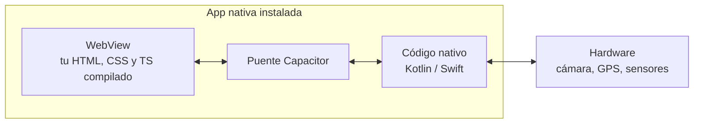
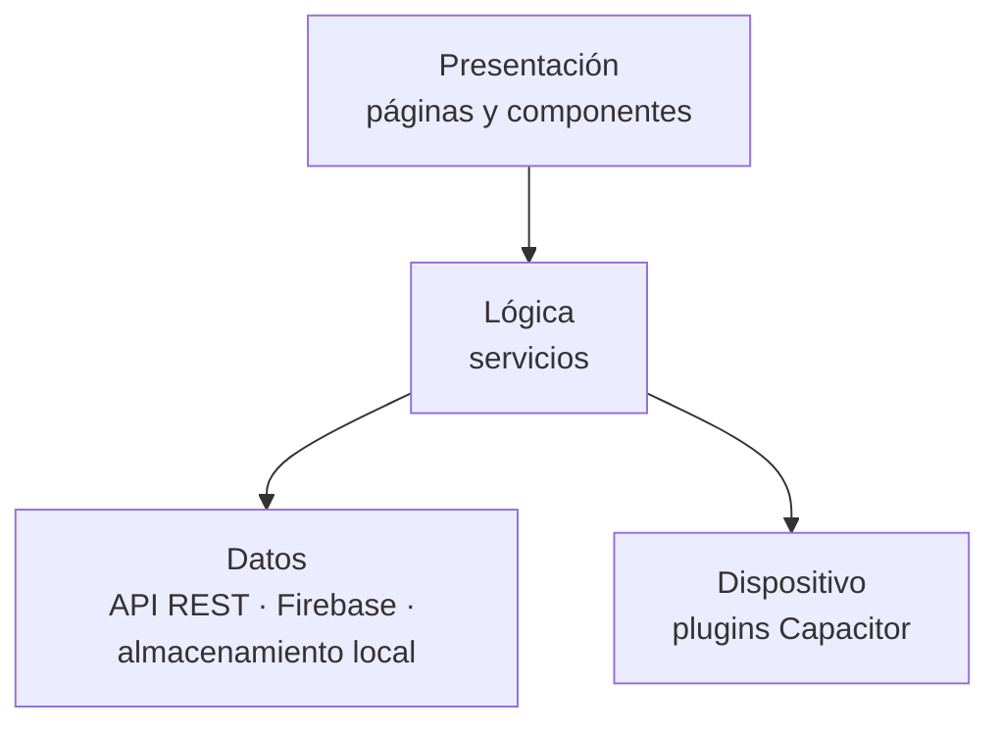

# UD1 · Arquitectura y fundamentos de las aplicaciones híbridas

**RA1** · Sesiones 1 y 2 (28 sep y 5 oct) · 6 horas

!!! abstract "Al terminar esta unidad sabrás"
    - Distinguir una app nativa, web, PWA, híbrida y multiplataforma, y cuándo conviene cada una.
    - Explicar cómo funciona por dentro una app híbrida (WebView + puente nativo).
    - Elegir tecnología para un proyecto y justificarlo.
    - Diseñar una pantalla *mobile-first* que se adapte a cualquier tamaño.
    - Convertir una web sencilla en una app Android con Capacitor.

## 1. Tipos de aplicaciones móviles

| Tipo | Cómo se hace | Ventajas | Inconvenientes | Ejemplos |
|---|---|---|---|---|
| **Nativa** | Un código por plataforma: Kotlin (Android), Swift (iOS) | Máximo rendimiento y acceso total al hardware | Dos equipos, dos códigos, más coste | WhatsApp, apps de bancos |
| **Web** | Web normal que se abre en el navegador | Sin instalación, se actualiza al instante | Acceso limitado al hardware, no está en las tiendas | Gmail web |
| **PWA** | Web con *manifest* y *service worker*: instalable y funciona offline | Instalable sin tienda, barata | Soporte desigual en iOS, hardware limitado | Twitter Lite, Starbucks |
| **Híbrida** | Web (HTML/CSS/JS) dentro de una app nativa que la muestra en un **WebView** | Un código para Android, iOS y web. Equipos web | Rendimiento algo menor en animaciones y gráficos intensos | Apps hechas con Ionic + Capacitor |
| **Multiplataforma nativa** | Un código que se traduce a componentes nativos o se dibuja con su propio motor | Rendimiento casi nativo con un solo código | Lenguaje y ecosistema propios | React Native, Flutter, Kotlin Multiplatform |

!!! question "Piensa"
    Una cadena de tiendas quiere una app de fidelización con tarjeta de puntos, catálogo y notificaciones. Tiene un equipo de 3 desarrolladores web y poco presupuesto. ¿Qué tipo elegirías y por qué?

### ¿Por qué híbridas en 2026?

- **Un solo código** para Android, iOS y web reduce costes de desarrollo y mantenimiento.
- Los equipos pueden reutilizar lo que ya saben de desarrollo web, y **TypeScript y Angular** tienen mucha demanda en España, sobre todo en banca, seguros, administración y consultoría.
- Capacitor da acceso a prácticamente todo el hardware con plugins, y los WebView actuales son muy rápidos para apps de gestión, formularios y contenido.

**Cuándo NO elegir híbrida:** juegos 3D, edición de vídeo, apps de realidad aumentada intensiva o que necesitan exprimir el hardware al máximo.

## 2. Cómo funciona una app híbrida por dentro



1. **WebView:** un navegador sin barra de direcciones que ocupa toda la pantalla. Ahí se ejecuta tu app web.
2. **Puente (bridge):** cuando tu código TypeScript llama a `Geolocation.getCurrentPosition()`, Capacitor traduce la llamada al código nativo.
3. **Código nativo:** Capacitor ya incluye un proyecto Android (carpeta `android/`) y otro iOS (`ios/`). Lo abres con Android Studio o Xcode.
4. **Plugins:** cada funcionalidad del hardware es un plugin (`@capacitor/camera`, `@capacitor/geolocation`…).

!!! info "Cordova y Capacitor"
    Cordova fue la tecnología híbrida clásica. **Capacitor** (del equipo de Ionic) es su sucesor moderno: trata el proyecto nativo como código fuente que puedes abrir y modificar, y es el estándar actual.

## 3. Arquitectura de la aplicación

Además de la arquitectura técnica (WebView + puente), una app bien diseñada separa responsabilidades:



### Patrones que usaremos

| Patrón | Qué significa | Dónde lo verás |
|---|---|---|
| **Componentes** | La interfaz se divide en piezas reutilizables con su HTML, estilos y lógica | Todo el curso |
| **MVVM / separación vista-lógica** | La vista solo muestra; la lógica y los datos están en el componente y los servicios | UD2 |
| **Inyección de dependencias** | Los componentes piden los servicios que necesitan en lugar de crearlos | UD3 |
| **Repositorio** | Una clase oculta si los datos vienen de una API, de Firebase o del móvil | UD4 |
| **Observador / reactividad** | La vista se actualiza sola cuando cambian los datos (signals, observables) | UD2–UD4 |
| **Offline-first** | La app funciona sin red con datos locales y sincroniza después | UD4 |

## 4. Elegir tecnología

No existe la mejor tecnología, sino la más adecuada para cada proyecto. Estos son los criterios que usarás en la [ficha de análisis](actividades.md#a13):

| Criterio | Pregunta |
|---|---|
| Plataformas | ¿Android, iOS, web, escritorio? |
| Hardware | ¿Qué sensores o funciones nativas necesita? ¿Existe plugin? |
| Rendimiento | ¿Hay animaciones intensivas, 3D, vídeo en tiempo real? |
| Offline | ¿Tiene que funcionar sin conexión? |
| Equipo | ¿Qué lenguajes domina el equipo? |
| Presupuesto y plazo | ¿Cuántos desarrolladores y cuánto tiempo? |
| Mantenimiento | ¿Quién la mantendrá? ¿Cuántas actualizaciones al año? |
| Distribución | ¿Tiendas, web, distribución interna de empresa? |

### Frameworks más usados

| Tecnología | Lenguaje | Tipo |
|---|---|---|
| **Ionic + Angular + Capacitor** | TypeScript | Híbrida (la del curso) |
| Ionic + React / Vue + Capacitor | TypeScript | Híbrida |
| React Native | TypeScript | Multiplataforma nativa |
| Flutter | Dart | Multiplataforma con motor propio |
| Kotlin Multiplatform / Compose Multiplatform | Kotlin | Multiplataforma nativa |
| .NET MAUI | C# | Multiplataforma nativa |

## 5. Diseño mobile-first y responsive

**Mobile-first** significa diseñar primero para la pantalla pequeña y después ampliar para tablet y escritorio. Obliga a priorizar el contenido.

### Reglas básicas

- Incluye siempre la etiqueta *viewport*:

    ```html
    <meta name="viewport" content="width=device-width, initial-scale=1">
    ```

- Usa unidades relativas (`rem`, `%`, `vw`) en lugar de píxeles fijos.
- Zonas táctiles de **al menos 44–48 px** de alto.
- Maqueta con **Flexbox** y **Grid**.
- Escribe los estilos base para móvil y añade *media queries* hacia arriba:

```css
/* Base: móvil */
.tarjetas {
  display: grid;
  grid-template-columns: 1fr;
  gap: 1rem;
  padding: 1rem;
}

/* Tablet en adelante */
@media (min-width: 768px) {
  .tarjetas { grid-template-columns: repeat(2, 1fr); }
}

/* Escritorio */
@media (min-width: 1200px) {
  .tarjetas { grid-template-columns: repeat(4, 1fr); }
}
```

### Usabilidad en móvil

- Lo importante, en la parte inferior de la pantalla (zona del pulgar): tabs, botón principal.
- Una acción principal por pantalla.
- Respeta el modo oscuro (`prefers-color-scheme`) y el tamaño de letra del sistema.
- Contraste suficiente y textos alternativos en imágenes (accesibilidad).

## 6. Repaso de JavaScript moderno

La app de la UD1 es HTML + CSS + JavaScript sin framework. Usa JavaScript moderno:

```html title="index.html"
<!DOCTYPE html>
<html lang="es">
<head>
  <meta charset="UTF-8">
  <meta name="viewport" content="width=device-width, initial-scale=1">
  <title>CURSO 2026-2027</title>
  <link rel="stylesheet" href="css/estilos.css">
</head>
<body>
  <main class="contenedor">
    <p id="saludo">VIVA 2º DAM</p>
    <input id="entrada" type="text" placeholder="Escribe algo">
    <button id="btn-cargar">Cargar texto</button>
  </main>
  <script src="js/app.js" defer></script>
</body>
</html>
```

```js title="js/app.js"
const saludo = document.querySelector('#saludo');
const entrada = document.querySelector('#entrada');
const botonCargar = document.querySelector('#btn-cargar');

botonCargar.addEventListener('click', () => {
  saludo.textContent = entrada.value || 'Escribe algo primero';
});

saludo.addEventListener('mouseover', () => saludo.classList.add('resaltado'));
saludo.addEventListener('mouseout', () => saludo.classList.remove('resaltado'));
```

Buenas prácticas: `const`/`let` en lugar de `var`, `addEventListener` en lugar de `onclick` en el HTML, clases CSS en lugar de cambiar estilos a mano, y `defer` en la etiqueta `<script>` para que el JavaScript se ejecute cuando el HTML ya está cargado.

!!! note "¿Y `type=\"module\"`?"
    Los módulos de JavaScript no funcionan si abres el HTML con doble clic (`file://`): el navegador los bloquea. Con `defer` funciona en el navegador y en la app. Usaremos módulos más adelante, cuando Angular se encargue de servir la app.

!!! warning "En el móvil no hay `mouseover`"
    En una pantalla táctil no existe «pasar el ratón por encima». Para que la app funcione también en el móvil, acompaña `mouseover` de `pointerdown` o de un toque (`click`).

## 7. De web a app con Capacitor

Capacitor puede empaquetar cualquier web, incluso sin framework. Dentro de la carpeta del proyecto, con la web en una carpeta `www/`:

```bash
npm init -y
```

```bash
npm install @capacitor/core @capacitor/cli @capacitor/android
```

```bash
npx cap init "MiWeb" "es.iesrafaelalberti.miweb" --web-dir www
```

```bash
npx cap add android
```

```bash
npx cap sync android
```

```bash
npx cap open android
```

Cada vez que cambies la web:

```bash
npx cap sync android
```

El identificador (`es.iesrafaelalberti.miweb`) es el *application id*: debe ser único y no se puede cambiar después de publicar la app.

## Para saber más

- [Capacitor: documentación oficial](https://capacitorjs.com/docs)
- [MDN: diseño responsive](https://developer.mozilla.org/es/docs/Learn/CSS/CSS_layout/Responsive_Design)
- [web.dev: Progressive Web Apps](https://web.dev/explore/progressive-web-apps)
