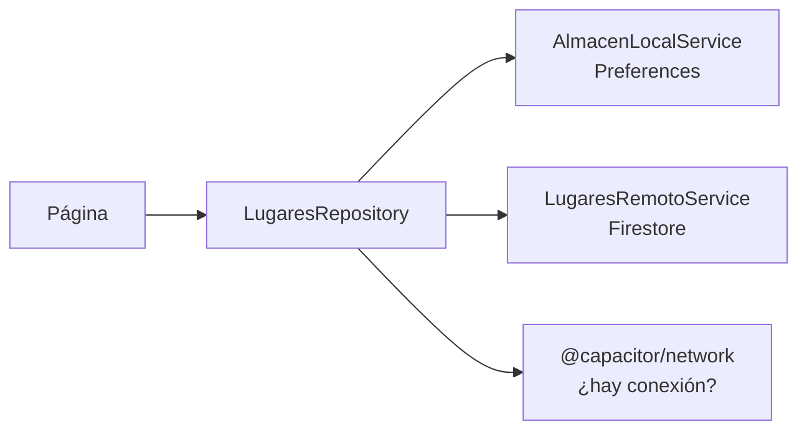

# UD4 · Consumo de servicios, APIs externas y persistencia

**RA2** · Sesiones 8 y 9 (30 nov y 14 dic) · 6 horas · Prueba de diciembre: 21 dic

!!! abstract "Al terminar esta unidad sabrás"
    - Consumir APIs REST con `HttpClient`, tipar las respuestas y gestionar los errores de red.
    - Guardar datos en el móvil con Preferences para que la app funcione sin conexión.
    - Guardar y sincronizar datos en la nube con Firebase Firestore.
    - Separar el origen de los datos con el patrón repositorio.

## 1. Qué es una API REST

Una API REST es un servidor que responde a peticiones HTTP con datos, normalmente en **JSON**.

| Método | Para qué | Ejemplo |
|---|---|---|
| `GET` | Leer | `GET /api/lugares` |
| `POST` | Crear | `POST /api/lugares` con el lugar en el cuerpo |
| `PUT` / `PATCH` | Modificar | `PUT /api/lugares/7` |
| `DELETE` | Borrar | `DELETE /api/lugares/7` |

Códigos de respuesta que debes reconocer: **200** correcto, **201** creado, **400** petición incorrecta, **401/403** sin permiso, **404** no existe, **500** error del servidor.

!!! tip "Prueba la API antes de programar"
    Abre la URL en el navegador o usa Postman / Bruno / Thunder Client para ver el JSON real. Así sabes qué interfaz TypeScript tienes que crear.

## 2. HttpClient

### Activarlo

```ts title="src/main.ts"
import { provideHttpClient, withFetch } from '@angular/common/http';

bootstrapApplication(AppComponent, {
  providers: [
    // ...lo que ya tenías
    provideHttpClient(withFetch()),
  ],
});
```

### Modelo + servicio

Ejemplo con la API pública de terremotos del USGS:

```ts title="src/app/models/terremoto.ts"
// Solo lo que necesitamos de la respuesta GeoJSON del USGS
export interface RespuestaUsgs {
  features: {
    id: string;
    properties: { mag: number; place: string; time: number; url: string };
    geometry: { coordinates: [number, number, number] };
  }[];
}

// Nuestro modelo interno, limpio y en castellano
export interface Terremoto {
  id: string;
  magnitud: number;
  lugar: string;
  fecha: Date;
  latitud: number;
  longitud: number;
  profundidadKm: number;
}
```

```ts title="src/app/services/terremotos.service.ts"
import { Injectable, inject } from '@angular/core';
import { HttpClient } from '@angular/common/http';
import { Observable, map, catchError, throwError, retry } from 'rxjs';
import { RespuestaUsgs, Terremoto } from '../models/terremoto';

@Injectable({ providedIn: 'root' })
export class TerremotosService {
  private http = inject(HttpClient);
  private url = 'https://earthquake.usgs.gov/earthquakes/feed/v1.0/summary/all_day.geojson';

  ultimos(): Observable<Terremoto[]> {
    return this.http.get<RespuestaUsgs>(this.url).pipe(
      retry(2),                                   // reintenta si falla la red
      map(respuesta => respuesta.features.map(f => ({
        id: f.id,
        magnitud: f.properties.mag,
        lugar: f.properties.place,
        fecha: new Date(f.properties.time),
        longitud: f.geometry.coordinates[0],
        latitud: f.geometry.coordinates[1],
        profundidadKm: f.geometry.coordinates[2],
      }))),
      catchError(error => {
        console.error('Error al cargar terremotos', error);
        return throwError(() => new Error('No se pudieron cargar los datos. Revisa tu conexión.'));
      }),
    );
  }
}
```

!!! info "Por qué mapear la respuesta"
    Si la API cambia, solo tocas el `map` del servicio y el resto de la app sigue igual. Además trabajas con nombres claros y tipos correctos (`Date` en lugar de un número).

### Usarlo en la página con estados de carga y error

```ts title="terremotos.page.ts"
export class TerremotosPage {
  private servicio = inject(TerremotosService);

  terremotos = signal<Terremoto[]>([]);
  cargando = signal(false);
  error = signal<string | null>(null);

  cargar() {
    this.cargando.set(true);
    this.error.set(null);
    this.servicio.ultimos().subscribe({
      next: datos => this.terremotos.set(datos),
      error: (e: Error) => { this.error.set(e.message); this.cargando.set(false); },
      complete: () => this.cargando.set(false),
    });
  }
}
```

```html title="terremotos.page.html"
<ion-button expand="block" (click)="cargar()" [disabled]="cargando()">Último terremoto</ion-button>

@if (cargando()) {
  <ion-spinner></ion-spinner>
} @else if (error()) {
  <ion-text color="danger"><p>{{ error() }}</p></ion-text>
} @else if (terremotos().length) {
  @let t = terremotos()[0];
  <ion-card>
    <ion-card-header>
      <ion-card-title>Magnitud {{ t.magnitud }}</ion-card-title>
      <ion-card-subtitle>{{ t.fecha | date:'short' }}</ion-card-subtitle>
    </ion-card-header>
    <ion-card-content>{{ t.lugar }} · {{ t.profundidadKm }} km</ion-card-content>
  </ion-card>
}
```

(`DatePipe` hay que importarlo en el componente.)

!!! note "Alternativas más modernas"
    - `toSignal(observable)` convierte un observable en un signal.
    - `httpResource()` es una API reciente de Angular que expone directamente `value()`, `isLoading()` y `error()` como signals. Consulta su estado actual en [angular.dev](https://angular.dev/guide/http/http-resource) antes de usarla en producción.

### URL de la API según el entorno

No escribas la URL de tu API a mano en cada servicio. Crea un fichero de configuración:

```ts title="src/environments/environment.ts"
export const environment = {
  production: false,
  apiUrl: 'https://mi-api-pmdm.onrender.com/api',
};
```

### CORS

Si tu API responde bien en Postman pero en el navegador ves *blocked by CORS policy*, **el problema está en el servidor**: la API tiene que permitir el origen de tu app. En Spring Boot se configura con `@CrossOrigin` o un `CorsConfigurationSource`. Los orígenes que usa tu app son `http://localhost:8100` (con `ionic serve`) y `https://localhost` / `capacitor://localhost` (en el móvil).

!!! warning "Render se duerme"
    Los servicios gratuitos de Render se suspenden tras un rato sin uso y la primera petición tarda hasta un minuto. Muestra un indicador de carga y un mensaje si tarda.

## 3. Persistencia local con Preferences

`@capacitor/preferences` guarda pares **clave → valor** (texto) en el almacenamiento nativo del móvil. Ideal para ajustes, favoritos o una caché pequeña.

```bash
npm install @capacitor/preferences
```

```bash
npx cap sync
```

```ts title="services/almacen-local.service.ts"
import { Injectable } from '@angular/core';
import { Preferences } from '@capacitor/preferences';

@Injectable({ providedIn: 'root' })
export class AlmacenLocalService {
  async guardar<T>(clave: string, valor: T) {
    await Preferences.set({ key: clave, value: JSON.stringify(valor) });
  }

  async leer<T>(clave: string, porDefecto: T): Promise<T> {
    const { value } = await Preferences.get({ key: clave });
    return value ? (JSON.parse(value) as T) : porDefecto;
  }

  async borrar(clave: string) {
    await Preferences.remove({ key: clave });
  }
}
```

| Opción | Para qué |
|---|---|
| `@capacitor/preferences` | Ajustes y datos pequeños |
| `@capacitor-community/sqlite` | Muchos datos con consultas (base de datos relacional en el móvil) |
| `localStorage` | Solo en web; en el móvil el sistema puede borrarlo |

## 4. Persistencia remota con Firebase Firestore

**Firestore** es una base de datos NoSQL en la nube de Google: guarda **documentos** JSON dentro de **colecciones** y avisa a la app en tiempo real cuando algo cambia.

### Configuración

1. En [console.firebase.google.com](https://console.firebase.google.com) crea un proyecto y una **app web**. Copia el objeto `firebaseConfig`.
2. Crea una base de datos **Firestore** en modo de prueba.
3. Instala las librerías:

    ```bash
    npm install firebase @angular/fire
    ```

4. Añade la configuración a `environment.ts` y los *providers* en `main.ts`:

```ts title="src/main.ts"
import { provideFirebaseApp, initializeApp } from '@angular/fire/app';
import { provideFirestore, getFirestore } from '@angular/fire/firestore';
import { environment } from './environments/environment';

bootstrapApplication(AppComponent, {
  providers: [
    // ...
    provideFirebaseApp(() => initializeApp(environment.firebase)),
    provideFirestore(() => getFirestore()),
  ],
});
```

### Servicio CRUD

```ts title="services/lugares-remoto.service.ts"
import { Injectable, inject } from '@angular/core';
import {
  Firestore, collection, collectionData, addDoc, deleteDoc, doc, updateDoc,
} from '@angular/fire/firestore';
import { Observable } from 'rxjs';
import { Lugar } from '../models/lugar';

@Injectable({ providedIn: 'root' })
export class LugaresRemotoService {
  private firestore = inject(Firestore);
  private coleccion = collection(this.firestore, 'lugares');

  todos(): Observable<Lugar[]> {
    // Se actualiza solo cuando cambia algo en la nube
    return collectionData(this.coleccion, { idField: 'id' }) as Observable<Lugar[]>;
  }

  crear(lugar: Omit<Lugar, 'id'>) {
    return addDoc(this.coleccion, lugar);
  }

  actualizar(id: string, cambios: Partial<Lugar>) {
    return updateDoc(doc(this.firestore, 'lugares', id), cambios);
  }

  borrar(id: string) {
    return deleteDoc(doc(this.firestore, 'lugares', id));
  }
}
```

En la página, conviértelo en signal:

```ts
lugares = toSignal(inject(LugaresRemotoService).todos(), { initialValue: [] });
```

### Reglas de seguridad

El modo de prueba deja la base abierta a todo el mundo durante unos días. Para el curso, unas reglas mínimas:

```text title="Reglas de Firestore"
rules_version = '2';
service cloud.firestore {
  match /databases/{database}/documents {
    match /lugares/{id} {
      allow read: if true;
      allow write: if request.resource.data.nombre is string
                   && request.resource.data.nombre.size() > 0;
    }
  }
}
```

!!! danger "Las claves de Firebase no son secretas, las reglas sí son tu seguridad"
    El `firebaseConfig` de una app web es público por diseño. Lo que protege tus datos son las **reglas**. En un proyecto real se añade **Firebase Authentication** y se exige `request.auth != null`.

## 5. El patrón repositorio y offline-first

La página no debería saber si los datos vienen del móvil o de la nube. Un **repositorio** lo decide:



Estrategia **offline-first**:

1. Al arrancar, muestra lo que hay en local (instantáneo, sin red).
2. Si hay conexión, pide los datos remotos, actualiza la vista y guarda una copia local.
3. Si el usuario crea algo sin conexión, se guarda en local como *pendiente* y se envía cuando vuelva la red.

```ts
import { Network } from '@capacitor/network';

const estado = await Network.getStatus();   // estado.connected: true / false
Network.addListener('networkStatusChange', s => this.conectado.set(s.connected));
```

## Para saber más

- [Angular: HttpClient](https://angular.dev/guide/http)
- [AngularFire](https://github.com/angular/angularfire)
- [Firestore: modelo de datos](https://firebase.google.com/docs/firestore/data-model)
- [Capacitor Preferences](https://capacitorjs.com/docs/apis/preferences) · [Network](https://capacitorjs.com/docs/apis/network)
