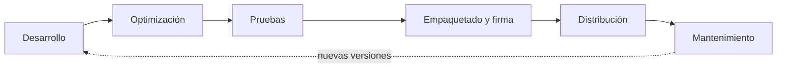

# UD5 · Optimización, pruebas y despliegue

**RA3** · Sesiones 11 a 15 (11 ene – 15 feb) · 15 horas

!!! abstract "Al terminar esta unidad sabrás"
    - Medir el rendimiento de una app con KPIs y mejorarlo, también con ayuda de IA.
    - Escribir tests unitarios y de integración con **Vitest** y tests E2E con **Cypress**.
    - Gestionar los errores de forma centralizada.
    - Generar un **AAB/APK firmado** y conocer los canales de distribución.
    - Documentar el desarrollo, las pruebas y el despliegue.

## 1. La fase final del ciclo de vida



En una app híbrida hay dos capas que optimizar y probar: la **web** (Angular + Ionic) y la **nativa** (permisos, plugins, versión de Android).

## 2. Optimización

### KPIs que vamos a medir

| KPI | Qué mide | Herramienta | Objetivo orientativo |
|---|---|---|---|
| Tamaño del bundle inicial | KB que descarga la app al arrancar | Salida de `ionic build --prod` | Lo menor posible; sin avisos de *budget* |
| LCP (*Largest Contentful Paint*) | Cuándo se ve el contenido principal | Lighthouse | < 2,5 s |
| TBT / INP | Bloqueo del hilo principal y respuesta a la interacción | Lighthouse | TBT < 200 ms · INP < 200 ms |
| Peticiones HTTP por pantalla | Llamadas repetidas o innecesarias | DevTools → *Network* | Sin duplicados |
| Puntuación Lighthouse | Rendimiento, accesibilidad, buenas prácticas | Lighthouse | ≥ 90 en cada apartado |
| Memoria | Fugas al navegar | DevTools → *Memory* | No crece indefinidamente |

Para medir con Lighthouse: `ionic build --prod`, sirve la carpeta `www/` (por ejemplo con `npx http-server www`) y en Chrome abre DevTools → **Lighthouse** → modo *Mobile*.

### Técnicas en Angular

| Técnica | Cómo | Efecto |
|---|---|---|
| **Lazy loading** de rutas | `loadComponent: () => import(...)` | La app arranca cargando solo la primera página |
| **`@defer`** | Envuelve bloques pesados de la plantilla | Se cargan cuando se ven o cuando el usuario interactúa |
| **`track`** en `@for` | Usa un identificador único | Angular no repinta toda la lista al cambiar un elemento |
| **Signals + `computed`** | En lugar de funciones en la plantilla | Los cálculos solo se repiten si cambian sus datos |
| **Limpieza** | `DestroyRef`, `takeUntilDestroyed()`, `clearWatch`, `remove()` | Sin fugas de memoria ni sensores activos |

```html
@defer (on viewport) {
  <app-mapa [lugares]="lugares()" />
} @placeholder {
  <ion-skeleton-text animated style="height: 200px"></ion-skeleton-text>
}
```

### Técnicas en Ionic

- Imágenes con `` y tamaño adecuado (en Ionic 9 ya no existe `ion-img`).
- Listas muy largas: `ion-infinite-scroll` o *virtual scroll* del CDK de Angular.
- `ion-skeleton-text` mientras se carga para que la app *parezca* más rápida.
- Evita escuchar eventos de *scroll* o gestos sin necesidad; usa `GestureController` para gestos propios.

### Técnicas de red

- **Cachea** las respuestas que no cambian a menudo (en memoria con `shareReplay(1)` o en Preferences).
- No repitas la misma petición en cada `ionViewWillEnter`: comprueba si ya tienes datos recientes.
- Pide solo lo necesario (paginación, filtros en el servidor).

### Optimizar con IA

Los asistentes de IA son buenos detectando malas prácticas si les das **contexto y criterios**:

```text title="Ejemplo de prompt"
Eres revisor de código Angular (versión actual, standalone, signals, control flow @if/@for).
Revisa este componente y su servicio. Para cada problema indica:
1) qué buena práctica incumple (lazy loading, track, fugas de memoria, peticiones duplicadas,
   lógica en la plantilla...), 2) qué KPI empeora, 3) el código corregido.
No cambies la funcionalidad.
[pega aquí el código]
```

!!! tip "Servidor MCP de Angular"
    El CLI de Angular incluye un servidor MCP que permite a los asistentes compatibles consultar la documentación y las buenas prácticas actuales del framework. Reduce las respuestas con sintaxis antigua.

**Siempre** mide antes y después: una optimización que no mejora un KPI no es una optimización.

## 3. Pruebas

### Tipos de pruebas

| Tipo | Qué prueba | Herramienta | Velocidad |
|---|---|---|---|
| **Unitarias** | Una función, un servicio, un componente aislado | Vitest + TestBed | Milisegundos |
| **Integración** | Varias piezas juntas: componente + servicio + HTTP simulado | Vitest + TestBed + `HttpTestingController` | Milisegundos |
| **E2E** (extremo a extremo) | Flujos completos de usuario en un navegador real | Cypress | Segundos |
| **En dispositivo** | Permisos, hardware, rendimiento real | Móvil físico, emulador | Manual |

### Vitest: el runner de tests actual de Angular

Desde Angular 21 los proyectos nuevos usan **Vitest** en lugar de Karma + Jasmine. Los tests se ejecutan con:

```bash
npx ng test
```

!!! success "La plantilla de Ionic ya trae Vitest"
    Con Ionic 9, `ionic start` genera el proyecto con **Vitest** (comprobado en septiembre de 2026: Angular 22.1, Vitest 4). Si encuentras tutoriales con Karma y Jasmine, esta tabla te ayuda a traducirlos:

| Jasmine (Karma) | Vitest |
|---|---|
| `jasmine.createSpy()` | `vi.fn()` |
| `spyOn(obj, 'm').and.returnValue(x)` | `vi.spyOn(obj, 'm').mockReturnValue(x)` |
| `expect(spy).toHaveBeenCalledWith(a)` | igual |
| `fakeAsync` + `tick()` | `vi.useFakeTimers()` + `vi.advanceTimersByTime()` |

### Estructura de un test

```ts title="favoritos.store.spec.ts"
import { TestBed } from '@angular/core/testing';
import { FavoritosStore } from './favoritos.store';

describe('FavoritosStore', () => {
  let store: FavoritosStore;

  beforeEach(() => {
    TestBed.configureTestingModule({});
    store = TestBed.inject(FavoritosStore);
  });

  it('empieza vacío', () => {
    expect(store.favoritos()).toEqual([]);
  });

  it('añade un favorito', () => {
    store.anadir({ id: 1, nombre: 'La Caleta' });
    expect(store.favoritos().length).toBe(1);
  });

  it('no permite duplicados', () => {
    store.anadir({ id: 1, nombre: 'La Caleta' });
    store.anadir({ id: 1, nombre: 'La Caleta' });
    expect(store.favoritos().length).toBe(1);
  });
});
```

Patrón **AAA**: *Arrange* (preparar), *Act* (ejecutar), *Assert* (comprobar). Un test = una comprobación clara.

### Test de integración con HTTP simulado

```ts title="terremotos.service.spec.ts"
import { TestBed } from '@angular/core/testing';
import { provideHttpClient } from '@angular/common/http';
import { provideHttpClientTesting, HttpTestingController } from '@angular/common/http/testing';
import { TerremotosService } from './terremotos.service';

describe('TerremotosService', () => {
  let servicio: TerremotosService;
  let http: HttpTestingController;

  beforeEach(() => {
    TestBed.configureTestingModule({
      providers: [provideHttpClient(), provideHttpClientTesting()],
    });
    servicio = TestBed.inject(TerremotosService);
    http = TestBed.inject(HttpTestingController);
  });

  afterEach(() => http.verify());   // no quedan peticiones sin responder

  it('mapea la respuesta al modelo interno', () => {
    let resultado: any[] = [];
    servicio.ultimos().subscribe(datos => (resultado = datos));

    const peticion = http.expectOne(r => r.url.includes('earthquake.usgs.gov'));
    peticion.flush({
      features: [{
        id: 'abc',
        properties: { mag: 4.8, place: 'Golfo de Cádiz', time: 0, url: '' },
        geometry: { coordinates: [-7.5, 36.2, 10] },
      }],
    });

    expect(resultado[0].magnitud).toBe(4.8);
    expect(resultado[0].latitud).toBe(36.2);
  });
});
```

### Test de componente con servicio simulado

```ts title="lista.page.spec.ts"
import { TestBed } from '@angular/core/testing';
import { provideRouter } from '@angular/router';
import { signal } from '@angular/core';
import { ListaPage } from './lista.page';
import { LugaresRepository } from '../services/lugares.repository';

describe('ListaPage', () => {
  it('muestra los lugares del repositorio', async () => {
    const repoFalso = { lugares: signal([{ id: '1', nombre: 'La Caleta' }]), cargar: vi.fn() };

    await TestBed.configureTestingModule({
      imports: [ListaPage],
      providers: [provideRouter([]), { provide: LugaresRepository, useValue: repoFalso }],
    }).compileComponents();

    const fixture = TestBed.createComponent(ListaPage);
    fixture.detectChanges();
    await fixture.whenStable();

    expect(fixture.nativeElement.textContent).toContain('La Caleta');
    expect(repoFalso.cargar).toHaveBeenCalled();
  });
});
```

!!! info "Ionic en los tests"
    Los componentes de Ionic son *web components*. En el entorno simulado de Vitest (jsdom) su lógica interna no siempre se ejecuta, así que **comprueba el texto y el estado de tu componente**, no el interior de `ion-*`. Para probar la interfaz completa está Cypress.

### Cypress: pruebas E2E

```bash
npm install -D cypress
```

```bash
npx cypress open
```

Configura la URL base y el *shadow DOM* de Ionic:

```ts title="cypress.config.ts"
import { defineConfig } from 'cypress';

export default defineConfig({
  e2e: {
    baseUrl: 'http://localhost:8100',
    includeShadowDom: true,
    viewportWidth: 390,
    viewportHeight: 844,
  },
});
```

Test **determinista**: la API se simula con `cy.intercept` y un *fixture*, así el test no depende de internet.

```ts title="cypress/e2e/buscar.cy.ts"
describe('Buscar y ver detalle', () => {
  beforeEach(() => {
    cy.intercept('GET', '**/summary/all_day.geojson', { fixture: 'terremotos.json' }).as('api');
    cy.visit('/terremotos');
  });

  it('carga el último terremoto', () => {
    cy.get('[data-cy=btn-ultimo]').click();
    cy.wait('@api');
    cy.contains('Magnitud 4.8').should('be.visible');
  });
});
```

Pon atributos `data-cy="..."` en los elementos que vayas a usar en los tests: no cambian aunque cambie el diseño.

Para ejecutar los tests E2E, deja `ionic serve` en una terminal y en otra:

```bash
npx cypress run
```

### Pruebas en dispositivos

Antes de publicar, prueba en **al menos un móvil real y un emulador** con otra versión de Android, y en condiciones difíciles: sin red, con red lenta (DevTools → *Network → Slow 4G*), con permisos denegados, girando la pantalla y con letra grande.

## 4. Gestión de errores

### Interceptor HTTP: un solo sitio para los errores de red

```ts title="interceptors/errores.interceptor.ts"
import { HttpInterceptorFn } from '@angular/common/http';
import { inject } from '@angular/core';
import { catchError, throwError } from 'rxjs';
import { AvisosService } from '../services/avisos.service';

export const erroresInterceptor: HttpInterceptorFn = (req, next) => {
  const avisos = inject(AvisosService);
  return next(req).pipe(
    catchError(error => {
      const mensaje = error.status === 0
        ? 'Sin conexión con el servidor'
        : `Error ${error.status} al contactar con el servidor`;
      avisos.error(mensaje);
      return throwError(() => error);
    }),
  );
};
```

```ts title="main.ts"
provideHttpClient(withFetch(), withInterceptors([erroresInterceptor])),
```

### Avisos al usuario con toasts

```ts title="services/avisos.service.ts"
import { Injectable, inject } from '@angular/core';
import { ToastController } from '@ionic/angular';

@Injectable({ providedIn: 'root' })
export class AvisosService {
  private toast = inject(ToastController);

  async error(mensaje: string) {
    const t = await this.toast.create({ message: mensaje, duration: 3000, color: 'danger', position: 'bottom' });
    await t.present();
  }
}
```

### Errores no capturados

Un `ErrorHandler` propio registra cualquier error que se escape (en consola, en un servicio de *logging* como Sentry o Firebase Crashlytics):

```ts
export class ManejadorErrores implements ErrorHandler {
  handleError(error: unknown) {
    console.error('[AppError]', error);
  }
}
// main.ts → { provide: ErrorHandler, useClass: ManejadorErrores }
```

### Troubleshooting sistemático

1. **Reproduce** el error y anota los pasos.
2. **Localiza la capa**: ¿web (consola del navegador), nativa (Logcat en Android Studio) o servidor (logs de Render / Firebase)?
3. **Lee el mensaje completo** y busca el primer error, no el último.
4. **Aísla**: prueba en el navegador; si funciona allí y no en el móvil, sospecha de permisos, `cap sync` o CORS.
5. **Documenta** la causa y la solución en el README.

## 5. Despliegue

### Preparar la versión de producción

1. URLs y claves de producción en `environment.prod.ts`.
2. Icono y pantalla de inicio: coloca `icon.png` (1024×1024) y `splash.png` en `assets/` y genera todos los tamaños:

    ```bash
    npx @capacitor/assets generate --android
    ```

3. Sube la versión en `android/app/build.gradle`: `versionCode` (número entero que siempre crece) y `versionName` (texto visible, por ejemplo `1.0.0`).
4. Compila y sincroniza:

    ```bash
    ionic build --prod
    ```

    ```bash
    npx cap sync android
    ```

5. Revisa los **permisos** del `AndroidManifest.xml`: quita los que no uses.

### Firmar la app

Android solo instala apps **firmadas**. En Android Studio: **Build → Generate Signed App Bundle / APK**.

| Formato | Para qué |
|---|---|
| **AAB** (*Android App Bundle*) | Obligatorio para publicar en Google Play |
| **APK** | Instalar directamente o distribuir fuera de la tienda |

Al firmar se crea un **keystore** (fichero `.jks`) con una contraseña.

!!! danger "Guarda el keystore"
    Si pierdes el keystore o su contraseña, **no podrás publicar actualizaciones** de esa app. Nunca lo subas a GitHub: añádelo al `.gitignore`.

### Canales de distribución

| Canal | Requisitos | Cuándo usarlo |
|---|---|---|
| **Google Play** | Cuenta de desarrollador (pago único) y AAB firmado. Las cuentas personales nuevas deben pasar una prueba cerrada con testers antes de publicar | Publicación pública |
| **Firebase App Distribution** | Proyecto Firebase | Probar con un grupo de testers |
| **APK directo** | Activar «instalar apps de origen desconocido» | Distribución interna, clase |
| **App Store (iOS)** | Mac con Xcode y cuenta de Apple Developer (anual) | Publicar para iPhone |
| **Web / PWA** | Hosting (Firebase Hosting, Netlify, GitHub Pages) | La misma app como web instalable |

## 6. Documentación

Un proyecto profesional se entiende leyendo su `README.md`. Estructura mínima:

```markdown title="README.md"
# Nombre de la app
Descripción en 2–3 líneas y captura.

## Tecnologías y versiones
Angular x · Ionic x · Capacitor x · Node x

## Instalación y ejecución
Pasos para clonar, instalar dependencias, configurar environment y arrancar.

## Arquitectura
Carpetas, servicios principales, diagrama de capas.

## Pruebas
Cómo ejecutar Vitest y Cypress. Qué cubren. Resultado (captura).

## Despliegue
Cómo generar el AAB/APK firmado. Versión actual. Canal de distribución.

## Problemas conocidos y soluciones
Errores encontrados y cómo se resolvieron.

## Uso de IA
Qué partes se hicieron con ayuda de IA y qué prompts se usaron.
```

## Para saber más

- [Angular: testing](https://angular.dev/guide/testing) · [migrar a Vitest](https://angular.dev/guide/testing/migrating-to-vitest)
- [Angular: `@defer`](https://angular.dev/guide/templates/defer)
- [Cypress: documentación](https://docs.cypress.io)
- [Capacitor: publicar en Android](https://capacitorjs.com/docs/android/deploying-to-google-play)
- [Chrome: Lighthouse](https://developer.chrome.com/docs/lighthouse)
